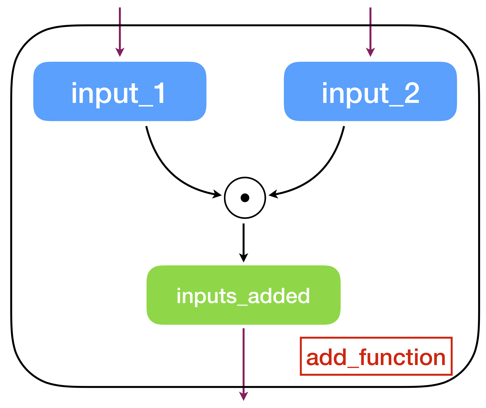

Welcome to the first session of the module --- _Deep Learning on Raspberry Pi_.

In this session, we will revisit the basic concepts of Linear Algebra. Then, we will familiarize ourselves with `numpy`, a Python package used for scientific computing and some basics of symbolic computation. At the end of this session, there will be a few exercises which will further help to understand the concepts introduced here.

## Linear Algebra

This section will only provide a brief introduction to Linear Algebra. For those of you who are unfamiliar with the concepts of Linear Algebra, it is strongly recommended that you spend some time with a text book or complete a course on Linear Algebra. A strongly recommended text book is [Introduction to Linear Algebra](math.mit.edu/~gs/linearalgebra/) by Gilbert Strang.

__Remarks__: In this module, we do not emphasize the geometry aspects of the Linear Algebra. Instead, we use the relevant concepts for programing and computation.

__Remarks__: Recently, Prof. Gilbert Strang published a new book [Linear Algebra and Learning from Data](https://math.mit.edu/~gs/learningfromdata/).

### Scalar, Vector, Matrix and Tensor

[](https://colab.research.google.com/drive/1Kn1f-4uVO7eGV0QzqXiJ7ekWUATI53OB)

+ A __Scalar__ is just a single number.

+ A __Vector__ is an array of numbers. These numbers are arranged in order. For example a vector $$\mathbf{x}$$ that has $$ n $$ elements is represented as:

    $$\mathbf{x}=\left[\begin{matrix}x_{1}\\ x_{2}\\ x_{3}\\ \vdots\\ x_{n}\end{matrix}\right]$$

    A `numpy` example of a 6-element vector is given as follows:

    ```python
    np.array([1, 2, 3, 4, 5, 6])  # a row vector that has 6 elements
    ```

    __Remarks__: by default, `numpy` can only represent row vector because `numpy` needs two dimensions to represent a column vector.

+ A __Matrix__ is a 2D array of numbers. Matrices are mainly used as linear operators to transform a vector space $$\mathbb{R}^m $$ to $$\mathbb{R}^n $$, which would be an $$ n\times m $$ matrix represented as:

    $$\mathbf{A}=\left[\begin{matrix}A_{11} & A_{12} & \cdots & A_{1m} \\
    A_{21} & A_{22} & \cdots & A_{2m} \\
    \vdots & \vdots & \ddots & \vdots \\
    A_{n1} & A_{n2} & \cdots & A_{nm}\end{matrix}\right]$$

    A `numpy` example:

    ```python
    np.array([[1, 2, 3, 4],
              [5, 6, 7, 8],
              [9, 10, 11, 12]])  # a 3x4 matrix
    ```

    The __matrix transpose__ is defined as $$\mathbf{A}^{\top}$$ where $$(\mathbf{A}^{\top}_{i,j})=\mathbf{A}_{j,i}$$. The transpose of the matrix can be thought of as a mirror image across the main diagonal. Python has a nice API for the matrix:

    ```python
    A_transpose = A.T
    ```

+ A multi-dimensional array is called a __tensor__. Note that scalars are 0-dimensional tensors, vectors are 1-dimensional tensors and matrices are 2-dimensional tensors.

    ```python
    np.ones(shape=(2, 3, 4, 5))  # a 4D tensor that has 2x3x4x5 elements which are filled as 1
    ```

### Matrix Arithmetic

[](https://colab.research.google.com/drive/13kqEOq6Jturill6baFlukshoeKgLgPXw)

+ Add between matrices

    $$\mathbf{C}=\mathbf{A}+\mathbf{B}\quad\text{where }\mathbf{C}_{i,j}=\mathbf{A}_{i,j}+\mathbf{B}_{i,j}$$

+ Add or multiply a scalar

    $$\mathbf{D}=a\cdot\mathbf{B}+c\quad\text{where }\mathbf{D}_{i,j}=a\cdot \mathbf{B}_{i,j}+c$$

+ Matrix multiplication, the product of two matrices $$\mathbf{A}\in\mathbb{R}^{m\times n}$$ and $$\mathbf{B}\in\mathbb{R}^{n\times p}$$ is the matrix $$\mathbf{C}$$:

    $$\mathbf{C}=\mathbf{A}\mathbf{B}$$

    where

    $$\mathbf{C}_{i,j}=\sum_{k=1}^{n}\mathbf{A}_{i,k}\mathbf{B}_{k,j}$$

    Note that matrix multiplication is order dependent, which means $$\mathbf{A}\mathbf{B}\neq\mathbf{B}\mathbf{A}$$ (not always). There are many useful properties. For example, matrix multiplication is both distributive and associative:

    $$\mathbf{A}(\mathbf{B}+\mathbf{C})=\mathbf{A}\mathbf{B}+\mathbf{A}\mathbf{C}$$

    $$\mathbf{A}(\mathbf{B}\mathbf{C})=(\mathbf{A}\mathbf{B})\mathbf{C}$$

    The transpose of a matrix product is:

    $$(\mathbf{A}\mathbf{B})^{\top}=\mathbf{B}^{\top}\mathbf{A}^{\top}$$


### Identity and Inverse Matrix

The __identity matrix__ $$\mathbf{I}\in\mathbb{R}^{n\times n}$$ is a special square matrix where all the entries along the diagonal are 1, while all other entries are zero:

$$\mathbf{I}_{i,i} = 1, \mathbf{I}_{i,j_{i\neq j}}=0$$

The identity matrix has the nice property that it does not change a matrix that it is multiplied with:

$$\mathbf{I}\mathbf{A}=\mathbf{A}$$

The __matrix inverse__ of $$\mathbf{A}$$ is denoted as $$\mathbf{A}^{-1}$$,
and it is defined as the matrix such that:

$$\mathbf{A}\mathbf{A}^{-1}=\mathbf{I}$$

__Remarks__: Not all matrices have a corresponding inverse matrix.


### Norms

We use the concept of __norm__ to measure the size of a vector. Formally an $$L^{p}$$ norm of a vector $$\mathbf{x}$$ is given by:

$$||\mathbf{x}||_{p}=\left(\sum_{i}|x_{i}|^{p}\right)^{\frac{1}{p}}$$

for $$p\in\mathbb{R}$$, $$p\geq 1$$.

The most common norms are $$L^{1}$$, $$L^{2}$$ and $$L^{\infty}$$ norms:

$$
\begin{aligned}
L^{1}:& \|\mathbf{x}\|_{1}=\sum_{i}|\mathbf{x}_{i}| \\
L^{2}:& \|\mathbf{x}\|_{2}=\sqrt{\sum_{i}\mathbf{x}_{i}^{2}} \\
L^{\infty}:& \|\mathbf{x}\|_{\infty} = \max_{i}|\mathbf{x}_{i}|
\end{aligned}
$$

### Trace Operator

The __trace operator__ gives the sum of all the diagonal entries of a matrix:

$$\text{Tr}(\mathbf{A})=\sum_{i}\mathbf{A}_{i,i}$$

There are many useful yet not obvious properties given by the trace operator. For example, for $$\mathbf{A}\in\mathbb{R}^{m\times n}$$ and $$\mathbf{B}\in\mathbb{R}^{n\times m}$$, we have:

$$\text{Tr}(\mathbf{A}\mathbf{B})=\text{Tr}(\mathbf{B}\mathbf{A})$$

even though $$\mathbf{A}\mathbf{B}\in\mathbb{R}^{m\times m}$$ and $$\mathbf{B}\mathbf{A}\in\mathbb{R}^{n\times n}$$.

__Remarks__: We do not intend to present a full review of Linear Algebra. For those who need to quickly learn the material, please read [Chapter 2 of the Deep Learning Book](http://www.deeplearningbook.org/contents/linear_algebra.html) or [Linear Algebra Review and Reference](http://www.cs.cmu.edu/~zkolter/course/15-884/linalg-review.pdf). Both resources give a very good presentation on the topic.

## Basic numpy

The contents of this section are mainly based on the [quickstart tutorial](https://docs.scipy.org/doc/numpy/user/quickstart.html) of `numpy` from the official website.

The main object in `numpy` is the homogeneous multi-dimensional array (or a tensor). The main difference between a Python multi-dimensional list and the `numpy` array is that elements of a list can be of different types, while the elements of a `numpy` array are of the same type.

`numpy`'s array class is called the `ndarray`, which also goes by the alias `array`. A few important attributes of the `ndarray` object are `ndarray.shape` which has the dimensions of the array, `ndarray.dtype` which has the type of elements in the array (e.g., `numpy.int16`, `numpy.float16`, `numpy.float32`, etc).

Let us look at an example.

[](https://colab.research.google.com/drive/1WEjFGPntn8VoF3aALXrf_12vreVTcnJ6)

```python
# this statement imports numpy with the alias np
# which is easier to use than the whole word 'numpy'
import numpy as np

# creates an array (0, 1, 2, ..., 14)
a = np.arange(15)

# should output (15,)
a.shape

# reshapes the above array of shape (15,) into (3, 5)
# notice the number of elements is still the same
a = a.reshape(3, 5)

# should output (3, 5)
a.shape

# type of the elements in the array
# should output int64, since it is the default dtype for the function arange
a.dtype

# recasts the elements of a into type int8
a = a.astype(np.int8)

# should output int8
a.dtype
```

To operate on `numpy` arrays, they have to be created. `numpy` arrays can be created in many ways.

[](https://colab.research.google.com/drive/1fwb030gz4IJTpPK6tnsP_N_5jhF5J_r8)

```python
# initialize from a list with the dtype float32, the dtype unless specified is int64 since
# the numbers in the list are integers
np.array([[1, 2], [3, 4]], dtype=np.float32)

# created an array initialized with zeros, the default dtype is float64
np.zeros(shape=(2, 3))

# fill an array with ones
np.ones(shape=(2, 3))

# linspace like the matlab function
np.linspace(0, 15, 30)  # 30 numbers from 0 to 15
```

Now that the arrays are created, let us look at how the arrays can be operated on. The arithmetic operations on arrays are applied element wise.

[](https://colab.research.google.com/drive/19R9G5NaN8nqEKyKK_XMk-PG7zZyGmYM2)

```python
a = np.array([[1, 2], [3, 4]], dtype=np.float32)
b = np.array([[1, 1], [2, 2]], dtype=np.float32)
# subtracting one array from another element wise
a - b

# adding two arrays element wise
a + b

# multiplying two arrays element wise
a * b

# squaring the elements of each array
a ** 2

# applying the sine function on the array multiplied with pi / 2
np.sin(a * np.pi / 2)

# for the matrix product, there is a dot function
np.dot(a, b)

# element wise exponential of the array subtracted by 2
np.exp(a - 2)

# square root of the array element wise
np.sqrt(a)
```

Arrays of different types can be operated, the resulting array corresponds to the dtype of the more general or the more precise one.

[](https://colab.research.google.com/drive/1KRQMZOqYiMSoGk_Gj1F7eANCwK8YqaX6)


```python
a = np.array([[1, 2], [3, 4]], dtype=np.float64)
b = np.array([[1, 1], [2, 2]], dtype=np.float32)

c = a + b

# should be of type float 64
c.dtype

a = a.astype(np.int64)
c = a + b

# should be of type float 64
c.dtype
```

`numpy` also provides inplace operations to modify existing arrays.

[](https://colab.research.google.com/drive/1jr3tw19Dr8v7CjmrmbXGzqiTQr_Rfo7F)

```python
a = np.array([[1, 2], [3, 4]], dtype=np.float32)
b = np.array([[1, 1], [2, 2]], dtype=np.int32)

# adds the matrix b to the matrix a
a += b

# note that when trying to add a to b you get an error
b += a
```

There are many inbuilt unary operations as well, the names are self explanatory.

[](https://colab.research.google.com/drive/1O5aGVEP4oMQHyoWI-zwQfZUALJTRgWOa)

```python
a = np.array([[1, 2, 3], [4, 5, 6]])

# sum of all elements in the array
a.sum()

# sum of all elements along a particular axis
a.sum(axis=0)

# minimum of all elements in the array
a.min()

# -1 corresponds to the last dimension, -2 for the last but one and so on
# computes the cumulative sum along the last axis
a.cumsum(axis=-1)  
```

While 1D arrays can be indexed just like python native lists, multi-dimensional arrays can have one index per axis. These indices are in an n-length tuple for an n-dimensional array.

[](https://colab.research.google.com/drive/1EI8RjvDN87a8k896wK8MVcWpCJMuXcTJ)

```python
a = np.arange(12)

a[2:5]  # indexes the 2nd element to the 4th element
# notice that the last element is the 4th element and not the 5th

# From the fifth element, indexing every two elements
a[4::2]

a = a.reshape(3, 2, 2)

a[:, 1, :]  # a simple colon represents all the elements in that dimension

# 1: indexes the 1st element to the last element whole
# :-1 indexes the 0th element to the last but one element
a[1:, :, 0]
```

Iterating over multidimensional arrays is done with respect to the first axis.

[](https://colab.research.google.com/drive/1GGYhICvXW1oNH0swmTQHe6v1lowTyCF8)

```python
a = np.arange(12).reshape(3, 2, 2)

for element in a:
  print(element)

for element in np.transpose(a, axes=[1, 0, 2]):
  print(element)
```

`numpy` broadcasts arrays of different shapes during arithmetic operations. Broadcasting allows functions to deal with inputs that do not have the same shape but expect inputs that have the same shape.

The first rule of broadcasting is that if all the input arrays do not have the same dimensions, a '1' will be **prepended** to the shapes of the smaller arrays until all the arrays have the same number of dimensions.

The second rule ensures that arrays with size '1' along a particular dimension act as if they had the size of the largest array in that dimension, with the value repeated in that dimension.

After these two rules, the arrays must be of the same shape, otherwise the arrays are not broadcastable. Further details can be found [here](https://docs.scipy.org/doc/numpy/user/basics.broadcasting.html).

[](https://colab.research.google.com/drive/1wXg_2NK4ErPzsOykHtjXjmgNfb3vEeAa)

```python
a = np.arange(4)
b = np.arange(5)

a + b  # throws an exception

c = a.reshape(4, 1) + b

c.shape
```

__Remarks__: Some of you might realize that we use `numpy` to manipulate `array` instead of `matrix`. And in fact, there is a data structure in `numpy` that is dedicated to `matrix` manipulation. However, `matrix` is a derived type of `array` and less flexible. Therefore, in this module and practice, we always use `ndarray`.

__Remarks__: For a more complete Python `numpy` Tutorial, please check [this document](http://cs231n.github.io/python-numpy-tutorial/) from Stanford CS231n class.

__Remarks__: Can you figure out what does the following code mean?

```python
a = np.zeros((0, 10))
```

## Basic Symbolic Computation

[](https://colab.research.google.com/drive/180zH8mevFZ7MNCApDnWd4CgIueo-qjjX)

While classical computing (numerical computing) defines variables and uses operations to modify their values, symbolic computation defines a graph of operations on symbols, which can be substituted for values later.
These operations can include addition, subtraction, multiplication, matrix multiplication, differentiation, exponentiation, etc.

Every operation takes as input symbols (tensors), and outputs symbols that can be further operated upon.

In this module, we will use [PyTorch](https://www.tensorflow.org/), a dedicated machine learning framework based on symbolic computation.

__Remarks__: Almost all modern Deep Learning libraries follows the principles of symbolic computation including TensorFlow, PyTorch, MXNET, etc.

First let us import PyTorch in python and implement some basic operations.

```python
import torch
from torch.nn import Module
```

In this example, we would like to implement an add function that
adds two tensors together. In PyTorch, we can implement the function in
the following way:

```python
class AddFunc(Module):
    """the add function."""
    def __init__(self):
        super(AddFunc, self).__init__()

    def forward(self, input_1, input_2):
        return input_1+input_2
```

Now, let's try to add two scalars together first
```python
add_func = AddFunc()

a = 37
b = 42

print(add_func(a, b))
```

Similarly, you can also add two vectors of the same shape instead of scalars.

```python
a = torch.tensor([1,2,3,4,5], dtype=torch.float)
b = torch.tensor([6,7,8,9,10], dtype=torch.float)

print(add_func(a, b))
```

The above code represents a _computation graph_ which takes two inputs and gives one output (see a graphical example below).

---

<div align="center">
    <p></p>
    <p>An example of a computation graph.</p>
</div>

---

Computation graph is the essential concept of symbolic computation where the `forward` function in this case define the steps of the computation and the graph compilation turns the graph into a __function__. The main advantage of using symbolic computation is _automatic differentiation_ which can be directly derived from a graph. Almost all training algorithms in
Deep Learning rely on this powerful technique.

__Remarks__: You might think, why is it so complicated to define a simple function like `add`? Certainly there are ways that contain less lines of code. However, this paradigm of constructing computation graph is widely used
in defining neural networks in later sessions.

We can also compute more than one thing at the same time by using multiple outputs. Say we want to add two tensors, subtract two tensors, perform an element-wise squaring operation on one of the tensors and get the element-wise exponential of the other tensor.

```python
class MultiFuncs(Module):
    """get multiple outputs."""
    def __init__(self):
        super(MultiFuncs, self).__init__()

    def forward(self, input_1, input_2):
        add = input_1+input_2  # add two tensors
        subtract = input_1-input_2  # subtract two tensor
        square_input_1 = input_1**2  # square the input_1
        exp_input_2 = torch.exp(input_2)  # e^input_2
        return add, subtract, square_input_1, exp_input_2

# define inputs
input_1 = torch.tensor([[1, 2], [3, 4]], dtype=torch.float)
input_2 = torch.tensor([[5, 6], [7, 8]], dtype=torch.float)

multi_funcs = MultiFuncs()

print(multi_funcs(input_1, input_2))
```

Now we can get to the important part of differentiating with respect to the variables. Let's try to compute the following example with PyToch


$$
\begin{aligned}
\mathbf{x} &= \{x_{1}, \ldots, x_{i}, \ldots, x_{N}\} \\
\mathbf{y} &= \{y_{1}, \ldots, y_{i}, \ldots, y_{N}\} \\
z &= \sum_{i=1}^{N}x_{i}^{2}+\sum_{i=1}^{N}y_{i}^{2} \\
\frac{\text{d} z}{\text{d}{\mathbf{x}}} &= ? \\
\frac{\text{d} z}{\text{d}{\mathbf{y}}} &= ?
\end{aligned}
$$

```python
class GradientExp(Module):
    """Gradient Example."""
    def __init__(self):
        super(GradientExp, self).__init__()

    def forward(self, input_1, input_2):
        return (input_1**2).sum()+(input_2**2).sum()

grad_exp = GradientExp()

input_1 = torch.tensor([1, 2, 3, 4, 5], dtype=torch.float, requires_grad=True)
input_2 = torch.tensor([6, 7, 8, 9, 10], dtype=torch.float, requires_grad=True)

output = grad_exp(input_1, input_2)

output.backward()

print(input_1.grad)  # dz/dx
print(input_2.grad)  # dz/dy
```

__Remarks__: The complete API reference is available at [PyTorch documentation ](https://pytorch.org/docs/stable/index.html).

### Exercises

1. Create a function to compute the expression $$\mathbf{a}^2 + \mathbf{b}^2 + \mathbf{c}^2 + 2\mathbf{b}\mathbf{c}$$. (Element-wise multiplication)

1. Create a tensor scalar $$x$$ and compute the $$\tanh$$ function on $$x$$ using the exponential function (__DO NOT USE `torch.nn.functional.tanh` API__). Then compute the derivative of the $$\tanh$$ with respect to $$x$$. Invoke the functions with the values -100, -1, 0, 1 and 100 to analyze the function and its derivative.

1. Create shape `(2,)` tensor $$\mathbf{w}$$ and the shape `(1,)` variable $$\mathbf{b}$$. Create shape `(2,)` placeholder $$\mathbf{x}$$. Now create the function corresponding to $$f(z) = \frac{1}{1+e^{-z}}$$ where $$z=w_0\times x_0+w_1\times x_1+b_0$$ and compute the gradient with respect to $$\mathbf{w}$$. Analyse the implemented operation. Then see how the function and the gradient behave for different values of the variables and the placeholder.

1. For an arbitrary $$n$$, create an $$n$$-degree polynomial for an input scalar $$\mathbf{x}$$ with $$(n+1)$$ variables and compute the gradients of the polynomial with respect to each of the variables.
