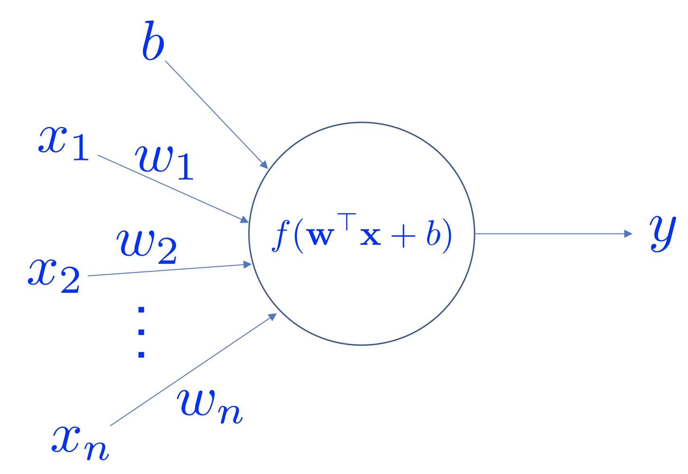
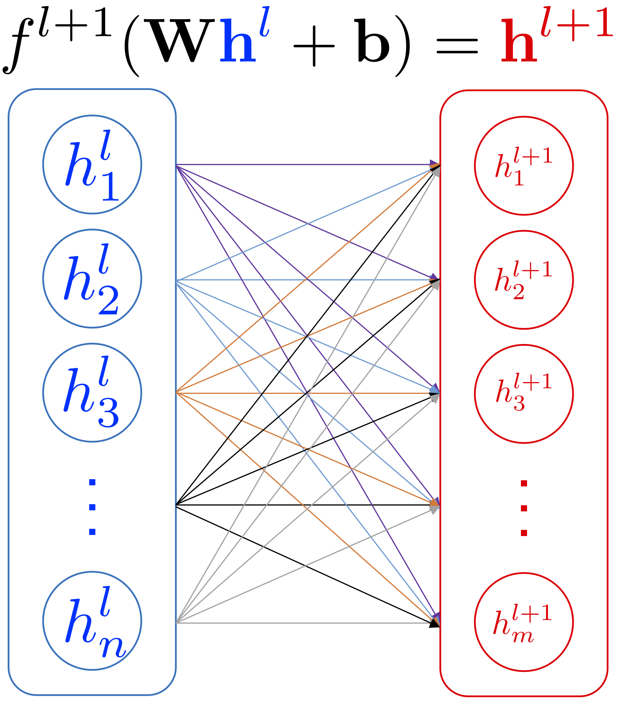
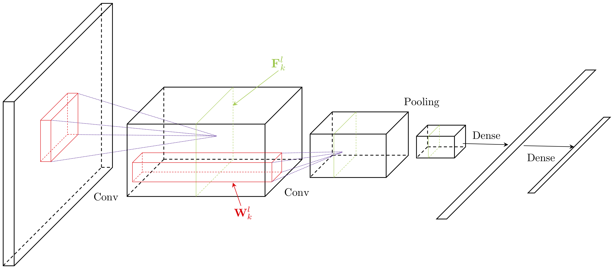

In this session, we are going to learn two types of __Artificial Neural Networks__ (ANNs): Multi-layer Perceptron (MLP) and Convolutional Neural Networks (ConvNets). These ANN architectures are also __Feedforward Networks__ (FNNs). We will show how they work and the links between them. In addition, we will also learn _regularization_ techniques that improve generalization during training.

## Deep Learning: Another Victim of the CS Naming Fashion

__Deep Learning__ (DL) is a terrible name. First of all, there is no concrete definition of the term "deep". In the influential review article _Deep Learning in Neural Networks: An Overview_, Schmidhuber says:

---

At which problem depth does _Shallow Learning_ end, and _Deep Learning_ begin? Discussions with DL experts have not yet yielded a conclusive response to this question. Instead of committing myself to a precise answer, let me just define for the purposes of this overview: problems of depth $$>10$$ require Very Deep Learning.

---

__Remark__: We encourage you to check out this fascinating review of Deep Learning.

Instead of the term "deep", "hierarchical" might be more suitable. However, modern (in the last two years) DL models cannot simply be characterized by "hierarchical" anymore (e.g., Neural Turning Machine models).

The second part of the name, "Learning", is also a misleading word. The "learning" process (via training) intends to improve the generalization in unseen examples. However, the concept does not associate with "learning" in the biological sense. The entire "learning" process is carried out by some powerful optimization algorithms (we call them "training" algorithms).

This is another example where computer scientists gave a terrible yet catchy name (the first example is "Computer Science" itself, check [here](https://ocw.mit.edu/courses/electrical-engineering-and-computer-science/6-001-structure-and-interpretation-of-computer-programs-spring-2005/video-lectures/1a-overview-and-introduction-to-lisp/) for reason). Yann LeCun, one of the founding fathers of DL, proposed to rename "Deep Learning" to "Differentiable
Programming" in a recent [Facebook post](https://www.facebook.com/yann.lecun/posts/10155003011462143). This is by far the most accurate definition. First, all modern DL models up to date are differentiable. Second, the optimization algorithms find a set of optimal parameters that "program" the model to exhibit some desired behaviors.

We have to remember that DL consists of many useful and powerful tools. However, DL alone is not AI, or Machine Learning.

__Remark__: To be exact, differentiable models are the largest family of DL models. However, there are DL models that are not differentiable and do not use SGD to optimize (e.g., some Reinforcement Learning algorithms).

__Remark__: Readers may wonder if _Machine Learning_ is an equally bad name. I would argue differently, for the reasons that ML was founded on the basis of determining quality of a predictor and in that case, more humble about its claims. 

## Artificial Neuron

Artificial Neural Networks (ANNs) are machine learning models that are inspired by neuroscience findings and are constructed by a mathematical abstraction of the functionality of biological neurons.

---

<div align="center">
    <p></p>
    <p>An artificial neuron.</p>
</div>

---

An artificial neuron receives a vector of input $$\mathbf{x}$$, and the output is determined by the activation function of the _weighted_ sum of the input vector and an optional bias value. Popular choices of activation functions are

$$
\begin{cases}
    \text{sigmoid} & \sigma(z)=\frac{1}{1+\exp(-z)} \\
    \text{tanh} & \tanh(z) = \frac{\exp(z)-\exp(-z)}{\exp(z)+\exp(-z)} \\
    \text{ReLU} & \text{ReLU}(z) = \max(0, z)
\end{cases}
$$

where $$z=\mathbf{w}\mathbf{x}+b$$ (the linear equation we have seen before), ReLU stands for "Rectified Linear Unit". Note that in practice there are more activation functions available (e.g., Leaky ReLU, ELU, softplus).

---

<div align="center">
    <p>
    
    </p>
    <p><b>Left</b>: the Sigmoid function; <b>Middle</b>: the tanh function; <b>Right</b>: the ReLU function.</p>
</div>

---

__Sigmoid function__ was very popular because (a) the function has a range between 0 to 1 so that one can interpret the level of activation to some meaning (e.g., probability, degree of activation); (b) the function is more "biologically plausible" than other activation functions for our artificial neuron model. However, in practice, the Sigmoid function has some very undesirable properties. One of the most significant issues is that the gradient of the neuron reaches zero when the activation of the neuron saturates at the tails of the function. When the gradient is
close to zero, the parameters that are associated with the neuron cannot be effectively updated.

__tanh__ is the scaled and shifted version of the Sigmoid function ($$\tanh(x)=2\sigma(2x)-1$$). This function squashes the function input to the range $$(-1, 1)$$. Compared to the Sigmoid function, the $$\tanh$$ function is zero-centered although it still has the saturation problem. In practice, one always prefers to use the $$\tanh$$ function rather than the Sigmoid function.

__ReLU__ became very popular in the last few years after the seminal work _ImageNet Classification with Deep Convolutional Neural Networks_ by Alex Krizhevsky, et al. was published in 2014. The function greatly accelerates the training compared to the Sigmoid or $$\tanh$$ functions. Additionally, ReLU is very cheap to compute. The ReLU function has its problems as well. For example, a neuron may not be activated by any inputs (e.g., always outputs zero) from the entire
dataset if the neuron experienced a large gradient flow. And because the ReLU is an open-ended function, the training may suffer from instability if the network has too many layers.

__Remark__: Although ReLU function is the most common choice of the activation function, the Sigmoid or $$\tanh$$ function have their market. In particular, they are preferable in Recurrent Neural Networks (RNNs) where the neuron receives feedback signals.

__Remark__: The artificial neuron model is inspired by neuroscience findings and can solve many different problems. However, one should not over-explain its connection with neuroscience because the model can be analyzed without any neuroscience knowledge.

A group of artificial neurons can be organized into a layer. A layer is the building block of ANNs. Interactions between and within layers shape the dynamics of the neural networks.

## Multi-layer Perceptron

The Multi-layer Perceptron (MLP) network is a canonical Feedforward ANN architecture. Let's firstly define its parent class - FeedForward Neural Networks (FNNs) before discussing the MLP networks.

FNNs are a class of ANNs where the computation flows in a single direction: there is no _feedback_ connection between layers. An FNN consists of $$L$$ layers where each layer $$l$$ is defined by its parameters $$\{\mathbf{W}^{l}, \mathbf{b}^{l}\}$$, which are referred to as weights and biases respectively. An activation function $$f^{l}(\cdot)$$ maps the layer input $$\mathbf{h}^{l-1}$$ to layer output $$\mathbf{h}^{l}$$:

$$
\begin{aligned}
    \mathbf{h}^{0} &= \mathbf{x} \\
    \mathbf{y} &= \mathbf{h}^{L} \\
    \mathbf{h}^{l} &= f^{l}\left(\mathbf{h}^{l-1}; \mathbf{W}^{l}, \mathbf{b}^{l}\right),\quad 1\leq l\leq L
\end{aligned}
$$

An alternative view of FNNs is that the network computes a composition of functions (Goodfellow et al., 2016; Poggio et al., 2017):

$$
\mathbf{y}=f^{L}(f^{L-1}(f^{L-2}(\cdots(f^{2}(f^{1}(\mathbf{x})))\cdots)))
$$

Note that the above formulation omits the method of computation between the layer input $$\mathbf{h}^{l-1}$$ and the parameters $$\{\mathbf{W}^{l}, \mathbf{b}^{l}\}$$. The result before applying the activation function is called _pre-activation_ and denoted as $$\mathbf{z}^{l}$$.

Now, we can describe the MLP network in a similar manner. Suppose the $$l$$-th layer has $$m$$ neurons and $$(l-1)$$-th layer has $$n$$ neurons, and the parameters $$\mathbf{W}^{l}\in\mathbb{R}^{m\times n}$$, $$\mathbf{b}^{l}\in\mathbb{R}^{m}$$. The input activation from $$(l-1)$$-th layer $$\mathbf{h}^{l-1}\in\mathbb{R}^{n}$$, the activation of $$l$$-th layer can be computed by:

$$
\mathbf{h}^{l}=f^{l}\left(\mathbf{W}^{l}\mathbf{h}^{l-1}+\mathbf{b}^{l}\right)
$$

A Keras example is as follows:

```python
from tensorflow.keras.layers import Dense, Activation

x = Dense(100)(x)  # the layer has 100 neuron
x = Activation("relu")(x)  # the activation function is ReLU
```

---

<div align="center">
    <p></p>
    <p>Example of MLP hidden layers.</p>
</div>

---

Conventionally, we call the first layer the input layer, the last layer the output layer, and the leftover layers the hidden layers. The input layer has a special array of neurons where each neuron has only one input value. The parameters are fixed as $$\{\mathbf{W}^{1}=\mathbf{I}, \mathbf{b}^{1}=\mathbf{0}\}$$ where $$\mathbf{I}$$ is the identity matrix. The activation function for the first layer is the linear activation $$f^{1}(z)=z$$.

Note that from the architecture point of view, MLP network is a generalization to Linear Regression and Logistic Regression (see [Session 2](./session_02.html)). Linear Regression and Logistic Regression are two-layered MLP networks. Furthermore, the activation functions of the Linear Regression and Logistic Regression
are $$f(x)=x$$ and $$f(x)=\sigma(x)$$ respectively.

The most profound mathematical argument on the MLP network may be the _Universal Approximation Theorem_. This theorem states that an MLP network with a single hidden layer that contains a finite number of neurons can uniformly approximate the target function $$f$$ with arbitrary precision. This theorem was first proved by George Cybenko in 1989 for Sigmoid activation functions. This theorem then generated a huge influence on researchers back in the 1990s and early 2000s.
Because a three-layered MLP network is a universal function approximator, researchers refused to go beyond three layers given limited computing resources at the time. However, the theorem does not give any information on how long the network takes to find a good approximation. And in practice, we usually found that it is usually very time costly compared to deeper architectures.

__Remark__: Because the MLP layer densely connects all the neurons between two layers, it is also referred to as Fully-Connected Layer or Dense Layer.

__Remark__: Shun'ichi Amari wrote a brilliant article titled _Neural theory of association and concept-formation_ in 1977. This paper explained how neural networks could perform unsupervised learning and supervised learning. Amazingly, it also showed how MLP-kind network could be trained via gradient descent.

## Convolutional Nerual Networks

Convolutional Neural Networks (ConvNets) is another type of FNN (Lecun et al., 1998). ConvNets were explicitly proposed to work with images. Furthermore, we can show that this model generalizes the MLP networks. ConvNets significantly accelerated the renaissance of neural networks
(Krizhevsky et al., 2012). They have proven to be great architectures for
achieving state-of-the-art results on visual recognition tasks, e.g., image and
video recognition (Simonyan & Zisserman, 2014; Szegedy et al., 2015; Ji et al.,
2013), object detection (Ren et al., 2015; Liu et al., 2015) and image caption
generation (Karpathy & Li, 2015; Vinyals et al., 2016). Recent results show
that certain types of ConvNets achieve comparable performance in Natural
Language Processing (NLP) tasks against RNNs (Zhang et al., 2015; Kalchbrenner et al., 2016).

---

<div align="center">
    <p></p>
    <p>ConvNets usually consist of convolution layers, pooling layers, and dense layers.</p>
</div>

---

### Convolution Layer

ConvNets heavily use 2D convolution on 3D tensors. Informally, a 2D convolution can be viewed as a filtering process where you have a filter that applies to the input tensor. Let's consider a concrete example where you have a $$5\times 5$$ binary image and a $$3\times 3$$ binary filter. The _valid convolution_ can be performed by using the filter as a sliding window and applying convolution operation at every possible position, the filter and the covered region does an element-wise multiplication and summation. See the
example as follows:

---

<div align="center">
    <p></p>
    <p>2D convolution on a 5x5 binary image with a 3x3 filter. Image Credit: <a href="http://ufldl.stanford.edu/tutorial/supervised/FeatureExtractionUsingConvolution/">UFLDL</a></p>
</div>

---

For example, when the filter is covering the top-left corner, the output value can be computed by

$$
\sum_{i,j}\left[\begin{matrix}
    1 & 1 & 1 \\
    0 & 1 & 0 \\
    0 & 0 & 1
\end{matrix}\right]\odot\left[\begin{matrix}
    1 & 0 & 1 \\
    0 & 1 & 0 \\
    1 & 0 & 1
\end{matrix}\right] = \sum_{i,j}\left[\begin{matrix}
    1 & 0 & 1 \\
    0 & 1 & 0 \\
    0 & 0 & 1
\end{matrix}\right] = 4
$$

More generally, if the input image is of dimension $$N_{h}\times N_{w}$$ and the filter size is $$K_{h}\times K_{w}$$, the output size of the convolved output is $$(N_{h}-K_{h}+1)\times(N_{w}-K_{w}+1)$$. This convolved output is usually referred to as a _feature map_. Commonly, we call the input of a convolution layer the _input feature map(s)_ and the output the _output feature map(s)_.

In the above example, the input binary image has only one _channel_, which means the image is a 2D array. However, an RGB image usually has three _channels_ where these channels represent the red intensity, the green intensity, and the blue intensity correspondingly. The mixture of these three channels produces a color image. How can a convolution layer deal with an input that has multiple channels? The answer is that we also give more channels to
the filter. Suppose that the input has $$N_{f}$$ channels (or feature maps), the filter will also have $$K_{n}=N_{f}$$ channels. First, each channel of the filter is applied on the corresponding channel of the input. Second, the convolved outputs of all feature maps are summed along the axis of the channels so that they are combined into one output feature map. A visual example is given as follows

---

<div align="center">
<iframe src="./res/conv-demo/index.html" width="100%" height="700px;" style="border:none;"></iframe>
    <p>Convolution on a 3x7x7 image with two 3x3x3 filters. Image Credit: <a href="http://cs231n.github.io/convolutional-networks/">CS231n</a></p>
</div>

---

In the above example, the input feature map is a 3D tensor and the filter is also a 3D tensor. In ConvNets, every _convolution layer_ usually has $$K_{m}$$ filters; each filter can generate __one__ output feature map. Hence, the filters of a convolution layer can be characterized as a 4D tensor `number of filters x number of channels x height of filters x width of filters`. The input feature map is then transformed from a 3D tensor to another 3D tensor.

__Remark__: The number of channels/feature maps is also called the __depth__ of the layer input and output.

__Remark__: We use "feature map" and "channel" interchangeably for describing the layer input and output. For filters, we only use the term "channel" for describing their depth.

Additionally, there are two configurations for defining the convolution layer: _padding_ and _strides_. The padding operation pads additional rows and columns to each channel of the input feature maps. Usually, the operation pads a constant value such as 0. In some cases, one might append values that are generated from some distribution. The stride describes how we slide the filters. When the stride is 1, we move the filters one pixel at a time. When the stride is 2, the
filters jump two pixels at a time. The above example has a stride that is equal to 2 in both horizontal and vertical directions. A Keras example is as follows:

```python
from tensorflow.keras.layers import Conv2D, Activation

x = Conv2D(filters=10,          # this layer has 10 filters
           kernel_size=(3, 3),  # the filter size is 3x3
           strides=(2, 2),      # horizontal stride is 2, vertical stride is 2
           padding="same")(x)   # pad 0s so that the output has the same shape as input
x = Activation("relu")(x)
```

With the informal description above, we can now formally describe the convolution layer. The weights of the $$l$$-th convolution layer can be defined as a 4D tensor where the dimension of the tensor is determined by the number of filters $$K_{m}$$, number of channels $$K_{n}$$, the height of the filters $$K_{h}$$ and the width of the filters $$K_{w}$$ (e.g., $$\mathbf{W}^{l}\in\mathbb{R}^{K_{m}\times K_{n}\times K_{h}\times K_{w}}$$). The bias is a 1D tensor where the length is equal
to the number of filters (e.g., $$\mathbf{b}^{l}\in\mathbb{R}^{K_{m}}$$). Let the input feature maps $$\mathbf{F}$$ be a 3D tensor where the dimension is defined as the number of feature maps $$N_{f}$$, the height of the feature map $$N_{h}$$ and the width of the feature map $$N_{w}$$ (e.g., $$\mathbf{F}\in\mathbb{R}^{N_{f}\times N_{h}\times N_{w}}$$). Note that the MLP network is a special case when $$N_{h}=N_{w}=1$$.

$$
\begin{aligned}
    \mathbf{z}_{k_{m}}(i,j)&=\left(\mathbf{W}_{k_{m}}^{l}*\mathbf{F}\right)(i,j) \\
    &=\sum_{k_{n}}\sum_{k_{h}}\sum_{k_{w}}\mathbf{F}(k_{h}, k_{w})\mathbf{W}_{k_{m}}^{l}(i-k_{h}, j-k_{w})+\mathbf{b}_{k_{m}}^{l} \\
    \mathbf{h}_{k_{m}}^{l}&=f^{l}(\mathbf{z}_{k_{m}})
\end{aligned}
$$

The above equations demonstrate the convolution operation by using the $$k_{m}$$-th filter. The output of the layer $$\mathbf{h}^{l}$$ includes the activations (output feature maps) from all filters $$\{\mathbf{h}_{1}^{l}, \ldots, \mathbf{h}_{K_{m}}^{l}\}$$. Note that the above equations do not include zero-padding and stride parameters. Each element in the output feature maps is a neuron, and the value of the element represents the activation of the neuron. Under this
construction, consequently, each convolution layer usually has much fewer parameters than an MLP layer. At the same time, a convolution layer uses a lot more computing resources than an MLP layer. To compute one feature map, the corresponding filter is repeatedly used. This feature of the convolution layer is called _weight sharing_.

The last topic of this section is to calculate the output feature maps' tensor shape  given the horizontal padding $$P_{h}$$, the vertical padding $$P_{v}$$, the horizontal stride $$S_{h}$$ and vertical stride $$S_{v}$$, the output feature maps' tensor shape is:

$$
\begin{aligned}
    \hat{N}_{f}&=K_{m} \\
    \hat{N}_{h}&=(N_{h}-K_{h}+2P_{v})/S_{v}+1 \\
    \hat{N}_{w}&=(N_{w}-K_{w}+2P_{h})/S_{h}+1
\end{aligned}
$$

Note that in practice, we prefer to process a batch of 3D tensors instead of one. Therefore, usually, we define the input of the convolution with an additional dimension that represents the `batch_size`. The input feature maps can be characterized as a 4D tensor as well: `batch_size x number of feature maps x height of feature maps x width of feature maps`.

---

<div align="center">
    <p></p>
    <p>96 Filters from the first convolution layer learned by Krizhevsky et al. Each filter has a shape of 11x11x3. These filters mostly respond to edges, colors. Image Credit: <a href="http://cs231n.github.io/convolutional-networks/">CS231n</a></p>
</div>

---


__Remark__: Readers may recognize that the above examples compute "correlation" instead of "convolution". The correct convolution requires _filter flipping_ where one needs to transpose every channel of a filter. However, to demonstrate how the convolution is performed, we assume that all the filters have been "flipped".

### Pooling Layer

Another important component of ConvNets is pooling. The pooling operation is inspired by the complex cells in the Primary Visual Cortex (V1) (Hubel
& Wiesel, 1962). It serves as a way of sub-sampling and of introducing invariance. Max-pooling and average-pooling are notable examples of pooling operations which
are widely applied in DNNs.

In many ways, one can view the pooling layer as a variant of the convolution layer. Although this claim is not correct in general, this can help you understand the concept. Let's consider a filter that has the size $$K_{h}\times K_{v}$$ (the pooling size) that can carry out the pooling operation on a feature map. We also define the padding parameters $$P_{h}$$, $$P_{v}$$, and the stride parameters $$S_{h}$$, $$S_{v}$$. Now we slide this filter on the target feature map as in the convolution
process. At each covered region, instead of computing the weighted sum of the region, the filter applies a predefined function $$g$$ that extracts/computes the output value. The same filter carries out the same process to all other input feature maps. At the end of the pooling operation, the height and width of the output feature maps may be different from the input feature maps. However, the number of feature maps remains the same. The tensor shape of the output feature
maps can be calculated:

$$
\begin{aligned}
    \hat{N}_{f}&=N_{f} \\
    \hat{N}_{h}&=(N_{h}-K_{h}+2P_{h})/S_{h}+1 \\
    \hat{N}_{w}&=(N_{w}-K_{v}+2P_{v})/S_{v}+1
\end{aligned}
$$

In principle, one can parameterize the predefined pooling function $$g$$. Because the pooling layer is usually served as a way of sub-sampling, we often do not introduce extra parameters for the pooling function. We also rarely introduce any extra padding because of the same reason. Conventionally, we set the stride to be the same as the pooling size (e.g, $$K_{h}=S_{h}$$, $$K_{v}=S_{v}$$). This way, the covered regions are not overlapped while the filter is moving. We
commonly call this "non-overlapping pooling". In some situations, you can set the stride smaller than the pooling size. We hence refer to this case as "overlapped pooling".

---

<div align="center">
    
    
    <p><b>Left</b>: The pooling operation; <b>Right</b>: An example of Max-pooling. Image Credit: <a href="http://cs231n.github.io/convolutional-networks/">CS231n</a></p>
</div>

---

The rest of this section discusses two popular types of pooling: Max-pooling and Average-pooling.

The max-pooling selects the maximum value in the covered region and omits all other values. The max-pooling operation implements a certain degree of "translation invariance" at small scale because if the input feature maps have a small shift, the same maximum value can still be selected.
Given a set of input feature maps $$\mathbf{F}$$, for each input feature map $$\mathbf{F}_{n_{f}}$$ where $$1\leq n_{f}\leq N_{f}$$, the output feature map $$\hat{\mathbf{F}}_{n_{f}}$$ can be computed via the following equation:

$$
\begin{aligned}
\hat{\mathbf{F}}_{n_{f}}(i,j)&=\text{MaxPool}(\mathbf{F}_{n_{f}})\\
&=\max\left\{\mathbf{F}_{n_{f}}(i',j'); i'\in[iS_{v}, iS_{v}+K_{v}), j'\in[jS_{h}, jS_{h}+K_{h})\right\}
\end{aligned}
$$

where the $$i$$ (the row index) and $$y$$ (the column index) start from 0. We also assume that the padding has been done beforehand. A Keras example is given as follows:

```python
from tensorflow.keras.layers import MaxPooling2D

x = MaxPooling2D((2, 2))(x)  # perform max-pooling over 2x2 non-overlapping region
```

The average-pooling operation computes the average activation of the covered region:

$$
\begin{aligned}
\hat{\mathbf{F}}_{n_{f}}(i,j)&=\text{AvgPool}(\mathbf{F}_{n_{f}})\\
&=\frac{1}{K_{h}\times K_{v}}\sum_{i'\in[iS_{v}, iS_{v}+K_{v})}\sum_{j'\in[jS_{h}, jS_{h}+K_{h})}\mathbf{F}_{n_{f}}(i',j')
\end{aligned}
$$

A Keras example is given as follows:

```python
from tensorflow.keras.layers import AveragePooling2D

x = AveragePooling2D((2, 2))(x)  # perform average-pooling over 2x2 non-overlapping region
```

In practice, there are two kinds of special cases of max-pooling and average-pooling that are widely employed: global max-pooling and global average-pooling. The global max-pooling and average-pooling have the configurations where $$K_{h}=N_{h}$$, $$K_{v}=N_{w}$$, the padding is set to zero and stride is set to one.

Note that in this section, we only describe the pooling layers for 2D feature maps. There are other variants in Keras implementation that can deal with 1D or 3D feature maps.

__Remark__: Recently, people have started using convolutions that have larger strides to replace the pooling operation for sub-sampling, as seen in ResNets.

### Flatten and Dense Layers

The output of convolution and pooling layers for a single sample is organized in a 3D tensor. And commonly, we would like to reorganize this tensor to a 1D vector so that we can manipulate all "information" carried by the output easily. This process is called _flatten_. The flatten operation simply "stretches" an $$N$$-D tensor into a 1D vector. In Keras, you can use the `Flatten` layer to do this job:

```python
from tensorflow.keras.layers import Flatten

x = Flatten()(x)
```

Note that we always assume that the first dimension is reserved for `batch_size` and the flatten operation does not affect the first dimension. For example, if you flatten an input 4D tensor with the size `(64, 10, 20, 3)`, the flattened output is a 2D tensor with the size `(64, 10x20x3)`.

One main reason for performing the flatten operation is to append more MLP layers (see above figure). Because MLP layers only receive 1D vector as inputs, we will have to flatten the output of convolution layers before sending it into the MLP layers. In practice, we usually refer to MLP layers as Dense layers or Fully-Connected layers.

Note that it is possible to convert a 1D vector back to a 3D tensor via reshaping. This operation is sometimes used in practice if your desired output is characterized as a 3D volume.

__Remark__: The development of modern ConvNet-based architectures is beyond the scope of this module. But we do encourage readers to check out some seminal works in this field, such as AlexNet, GoogLeNet, VGGNet, OverFeat, ResNet.

With Keras, you can save your compiled model into a directed graph image. This model image can also provide additional information about the tensor shape of each layer. e.g.,

```python
from tensorflow.keras.utils import plot_model

plot_model(model, to_file='model.png',
           show_shapes=True)
```

## Regularization

Regularization techniques in DNNs aim to reduce the network generalization error which is the difference between training and testing errors. These
techniques usually bound the weights, stabilize training, and increase robustness against adversarial examples. This section introduces $$L^{2}$$
Regularization, Dropout and Batch Normalization (BN) (Ioffe & Szegedy, 2015). A more informative review of regularization in Deep Learning can be found in Goodfellow et al. (2016).

### $$L^{2}$$ Regularization

$$L^{2}$$ regularization is commonly referred to as _weight decay_. It has been broadly applied in DNNs in order to control the squared sum of the trainable parameters $$\theta$$. To apply $$L^{2}$$ regularization, one modifies the original cost function $$J$$ to $$\hat{J}$$:

$$
\hat{J}(\theta, \lambda)=J(\theta)+\lambda\|\theta\|_{2}^{2}
$$

where $$\lambda$$ is a small constant that controls the weight decay speed. A Keras example is given as follows:

```python
from tensorflow.keras import regularizers

x=Dense(64,
        kernel_regularizer=regularizers.l2(0.01))(x)  # add L2 regularization on weights of this layer 
```

Intuitively, as the $$L^{2}$$ regularization applies the constraints on the weights, it reduce the effects of overfitting by decreasing the magnitude of the weights.

Usually, $$L^{2}$$ regularization is not applied to the bias terms because it only makes a small difference. Note that in some books, the control parameter $$\lambda$$ is written as $$\frac{\lambda}{2}$$. This style of formulation helps while deriving the gradient updates.

__Remark__: $$L^{2}$$ Regularization is also known as _ridge regression_ or _Tikhonov regularization_.

### Dropout

Dropout is a simple yet effective regularization technique for mitigating overfitting (Srivastava et al 2014). Dropout first computes a binary mask where $$p$$% of the elements of the mask are stochastically set to zero. Then, the mask and the incoming layer inputs $$\mathbf{h}^{l-1}$$ perform an element-wise multiplication. Finally, the masked output $$\tilde{\mathbf{h}}^{l-1}$$ is used as the layer input. This binary mask switches the neuron off by turning the
activation to zero. Hence, the neuron will not be updated in the next gradient update.

$$
\begin{aligned}
    \mathbf{r}^{l}&\sim\text{Bernoulli}(p) \\
    \tilde{\mathbf{h}}^{l-1}&=\mathbf{r}^{l}\odot\mathbf{h}^{l-1} \\
    \tilde{\mathbf{h}}^{l}&=f^{l}(\tilde{\mathbf{h}}^{l-1})
\end{aligned}
$$

Note that this process is only performed during the network training so that the generalization could be improved. It switches off during the testing/inference phase. A Keras example is given as follows:

```python
from tensorflow.keras.layers import Dropout

x = Dropout(0.3)(x)  # 30 of the neurons are dropped
```

The dropout purposely adds noise to the system so that during training, the network is forced to make correct predictions with imperfect inputs. This process hence improves the robustness of the network to test samples.

Another way to explain the dropout is the network resemble view. Because at each batch training, the network switches $$p$$% neurons off, the masked network is trained while the weights of the other neurons are not updated. After training, since the dropout is not applied, we can intuitively view that all the masked networks during training are combined to produce prediction simultaneously.

__Remark__: From the formulation, Dropout connects to another classical architecture - _Denoising Autoencoder_. Interested readers can check out this architecture.

### Batch Normalization

Batch Normalization (BN) was proposed as a strategy for reducing internal
covariate shift (Ioffe & Szegedy, 2015). Internal covariate shift is characterized
as “the change in the distribution of network activations due to the change in
network parameters during training”. Mathematically, BN is defined as:

$$
\hat{\mathbf{h}} = \text{BN}(\mathbf{h};\gamma, \beta)=\beta+\gamma\odot\frac{\mathbf{h}-\mathbb{E}[\mathbf{h}]}{\sqrt{\text{Var}[\mathbf{h}]+\varepsilon}}
$$

where the equation takes the layer's output activation $$\mathbf{h}$$ and normalizes it into $$\hat{\mathbf{h}}$$, $$\gamma$$ and $$\beta$$ are trainable parameters that are called scale and shift parameters respectively, and $$\varepsilon$$ is a small regularization constant. A Keras example is as follows:

```python
from tensorflow.keras.layers import BatchNormalization

x = BatchNormalization()(x)  # perform BN on the input
```

The use of BN in DNNs greatly smooths the network training in practice. It is not used as a default component in many DNNs architectures (e.g., ResNets). The application of BN in RNNs is recently explored in Cooijmans et al. (2016).

Note that one has to perform BN in both training and inference phases. The only difference is that during the inference phase, the trained $$\gamma$$ and $$\beta$$ parameters are not updated anymore. Furthermore, there are techniques to rescale the trained weights according to BN's trained parameters so that one can avoid BN's calculation during the inference phase. We omitted this detail because this is out of the scope of this module.

__Remark__: Since the Batch Normalization was proposed, there is a trend of abandoning Dropout as the Dropout seems to make a small difference in training.

## Exercises

1. In this exercise, you will need to implement a multi-layer perceptron to classify the images in the [Fashion-MNIST](https://github.com/zalandoresearch/fashion-mnist) dataset into ten classes. As in last week's class, you will be provided with a [template script](./res/code/mlp-with-keras-layers-template.py) with the barebone structure of the implementation. You will need to complete the script by defining a multi-layer perceptron model with two hidden layers of 100 units each, each with 'relu' activation, using Keras layers, compile the model with the categorical cross entropy loss and an optimizer of your choice, and train the model. Note the performance of the model after every epoch and also note the number of parameters in the model.

2. In this exercise, you will need to implement a convolutional neural network to classify the images in the Fashion MNIST dataset into ten classes. You will be provided with a [template script](./res/code/conv-net-with-keras-layers-template.py) with the barebone structure of the implementation. You will need to complete the script by defining a convolutional neural network as described below, using Keras layers, compile and train the model as in the above exercise. Compare both the performance of this model and also the number of trainable parameters in this model to the multi-layer perceptron model trained in the above exercise.

    ---

    The convolutional neural network has a convolution layer with `20` kernels of size `7x7` each, with a `relu` activation followed by max pooling with a pool size of `(2, 2)` and a stride of `(2, 2)`. This is followed by another convolution layer with `25` kernels of size `5x5` each, with a `relu` activation followed by max pooling with a pool size of `(2, 2)` and a stride of `(2, 2)`. Now flatten the 2D output from the previous layer and apply a linear transformation to a space with `200` units, with a `relu` activation, followed by another linear transformation into `10` units. Use a `softmax` activation on the final layer to train the model as a classifier.

    ---

3. (Optional) In this exercise, you will need to implement a multi-layer perceptron as in the first exercise, but you will not be using the Keras layers but build the model from scratch like in the second exercise from last week. You will have to build a multi-layer perceptron with an arbitrary number of layers and an arbitrary number of units in each of the layers. You can assume the number of layers is given by a variable `num_layers` and set it to 2 like in the first exercise, and the number of units in each of the layers can be assumed to be encoded in a list `num_units` and set it to `[100, 100]` like in the first exercise. You will have to create the necessary input and target placeholders, create the necessary variables of appropriate shapes, perform the necessary operations as in a multi-layer perceptron, define the loss based on the model prediction and the target, and then define the gradients of the loss with respect to the variables in the model. Then you will have to define the train_function and the test_function like in the last model. You will be provided with a [template script](./res/code/mlp-basic-template.py) to help you with the peripheral script.

4. (Optional) Try to improve your first two exercises by using different regularization such as Dropout and Batch Normalization.

5. (Optional) Copy your first exercise's answer to a different script, and modify your network to a 30-layered MLP network where each layer has 20 neurons, can you still train the network? This exercise relates to the fundamental challenge of the DNNs - _the vanishing gradient problem_.
