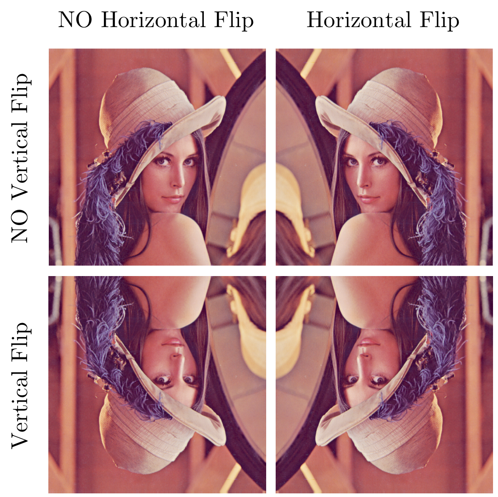

In this session, we focus on introducing basic concepts and techniques in __Digital Image Processing__ and __Computer Vision__. We would also like to discuss how you can apply these techniques to Machine Learning tasks. Note that we omit many mathematical details that are out of the scope of the session.

## Digital Image Representation

Before giving intuitive examples of _digital images_ or simply _images_, we would like to formally define the concept of digital image and _digital image processing_. One accurate definition is from the book _Digital Image Processing (2nd Edition)_ by Rafael C. Gonzalez and Richard E. Woods.

---

An image may be defined as a two-dimensional function, $$f(x,y)$$, where $$x$$ and $$y$$ are _spatial_ (plane) coordinates, and the amplitude of $$f$$ at any pair of coordinates $$(x,y)$$ is called the _intensity_ or _gray level_ of the image at that point. When $$x$$, $$y$$, and the amplitude values of $$f$$ are all finite, discrete quantities, we call the image a _digital image_. The field of _digital image processing_ refers to processing digital images by means of
a digital computer.

---

__Remark__: Although this book was published over a decade ago, the book presents a comprehensive introduction that both beginners and experts can enjoy reading.

With the above definition, we can define an image as a $$n\times m\times k$$ (`height x width x color_channels`) array where the image consists of $$n\times m$$ _pixels_ and $$n, m, k\in \mathbb{N}^{+}$$. The _resolution_ of an image is also determined by the number of pixels of the image.

A pixel is a point $$(x,y)$$ in an image. Typically, the intensity of a pixel is denoted as one or an array of `uint8` values. `uint8` is unsigned 8-bit integer that has the range $$[0, 255]$$ (0 is no color, 255 is full color). If there is only one color channel
($$k=1$$), the image is typically stored as a _grayscale_ image. The intensity of a pixel is then represented by one `uint8` value where 0 is black and 255 is white. If there are three color channels ($$k=3$$), we define that the first, the second and the third channel are the <font color="red">red</font> channel, the <font color="green">green</font> channel and the <font color="blue">blue</font> channel respectively. We hence refer this type of image to as _RGB_
color image. The intensity of a pixel in an RGB image is represented by three `uint8` integers where these three integers express the mixture of the three base colors - red, green and blue. You can interpret the value of a certain channel as the degree of the color intensity. Because each pixel has three `uint8` values, each RGB pixel can represent $$2^{24}$$ different colors.

The grayscale and the RGB encodings are only two types of image color-spaces. There are other image color-spaces such as YCrCb, HSV, HLS that are widely applied in many other applications. We do not discuss these color-spaces here.

---

<div align="center">
    
    <p>Lenna: Goddess of Digital Image Processing.</p>
</div>

---

The above picture is one of the most famous testing images - __Lenna__ (or Lena). The resolution of the image is $$512\times 512$$.  The image has both simple and complex textures, a wide range of colors, nice mixture of detail, shading, all of which are very useful when testing various image processing algorithms. Lenna is truly a goddess of digital image processing. If you would like to read more about the story of Lenna, please follow [this link](http://www.lenna.org/). A more recent post by WIRED can be
found [here](https://www.wired.com/story/finding-lena-the-patron-saint-of-jpegs/).

Given a grayscale or RGB image, we can naturally treat the image as a matrix or a 3D tensor. We can then process images using our knowledge of Linear Algebra.

## Image Geometric Transformation

This section introduces some simple ways for manipulating images such as scaling, translation, rotation and affine transformation. These geometric transformations are presented with the help of OpenCV and scikit-image.

OpenCV is an optimized Computer Vision library that supports
multiple programming languages. The library implements many
classical and modern Image Processing and Computer Vision
related algorithms very efficiently. In this module, we use
the Python bindings of the OpenCV. If you have installed OpenCV,
you can import the package in your program as follows:

```python
import cv2
```

scikit-image (or `skimage`) is an optimized image processing library
that belongs to the scikit-learn family of libraries.
This library focuses on supporting image processing functions that are
important to Machine Learning tasks. To import this package in your program:

```python
import skimage
```

### Scaling

[](https://colab.research.google.com/drive/130dqzJgSGFdtdNZ_9fR__AiGhs7uBHvK)

Scaling (resizing) an image is related to up-sampling and down-sampling.
For example, the Max-Pooling operation we introduced in Session 3 is
a way of scaling an image. In this section, we shall use OpenCV's API
to rescale an image.

```python
import cv2
import numpy as np

# read the image file
img = cv2.imread("Lenna.png")  # put the lenna.png at the same directory as the script

# fx: scaling factor for width (x-axis)
# fy: scaling factor for height (y-axis)
res = cv2.resize(img, None, fx=2, fy=2, interpolation=cv2.INTER_CUBIC)

#OR

# extract height and width of the image
height, width = img.shape[:2]
# resize the image
res = cv2.resize(img, (2*width, 2*height), interpolation=cv2.INTER_CUBIC)

# display the image
cv2.imshow('rescaled', res)
cv2.waitKey(0)
cv2.destroyAllWindows()
```

Yo can find the detailed documentation of the `cv2.resize` [here](https://docs.opencv.org/2.4/modules/imgproc/doc/geometric_transformations.html#resize)

Note that OpenCV reverses the color channel order while encoding an RGB image.
OpenCV refers to this encoding as BGR. OpenCV uses the BGR as the default color space.
However, if you would like to process and plot the RGB image
using other libraries, you will need to
convert the channel ordering via the `cvtColor` API:

```python
res_rgb = cv2.cvtColor(res, cv2.COLOR_BGR2RGB)
```

For `skimage`, one can achieve the same effect via `imread` and `resize` APIs:

```python
from skimage.io import imread
from skimage.transform import resize
from skimage.transform import rescale

import matplotlib.pyplot as plt

# read the image file
img = imread("Lenna.png")

# resize the image
height, width = img.shape[:2]
res = resize(img, (height*2, width*2))

# OR
# rescale the image by factor
res = rescale(img, (2, 2))

# display the image
plt.figure()
plt.imshow(res)
plt.show()
```

Check out the detailed documentation [here](http://scikit-image.org/docs/dev/api/skimage.transform.html).

### Translation

[](https://colab.research.google.com/drive/1RmXOP3TUlTCf11ZHiGMuRWXdFGF2pp3v)

Image translation shifts the content of an image to another pre-defined
location.

```python
import cv2
import numpy as np

# read the image, 0 means loading the image as a grayscale image
img = cv2.imread("Lenna.png", 0)
rows,cols = img.shape

# define translation matrix
# move 100 pixels on x-axis
# move 50 pixels on y-axis
M = np.float32([[1, 0, 100],[0, 1, 50]])
# translate the image
dst = cv2.warpAffine(img, M, (cols, rows))

# display the image
cv2.imshow('img', dst)
cv2.waitKey(0)
cv2.destroyAllWindows()
```

In the above example, one has to define a translation matrix `M`:

$$
M = \left[\begin{matrix}
    1 & 0 & 100 \\
    0 & 1 & 50
\end{matrix}\right]
$$

Essentially, the above translation matrix shifts the pixel at $$(x, y)$$ to the new coordinations $$(\hat{x}, \hat{y})$$:

$$
\begin{aligned}
    \hat{x}&=x+100 \\
    \hat{y}&=y+50
\end{aligned}
$$

In `skimage`, one can translate the image by using the `warp` and `SimilarityTransform` APIs:

```python
from skimage.io import imread
from skimage.transform import warp
from skimage.transform import SimilarityTransform

import matplotlib.pyplot as plt

# read image
img = imread("Lenna.png", as_grey=True)

# translate the image
tform = SimilarityTransform(translation=(-100, -50))
warped = warp(img, tform)

# display the image
plt.figure()
plt.imshow(warped, cmap="gray")
plt.show()
```

### Rotation

[](https://colab.research.google.com/drive/1roCGZEaH4T2N98UCWNcPfuADLX582RnZ)

Rotation of an image by an angle $$\theta$$ in OpenCV is achieved by
defining a rotation matrix that has the form of

$$
M = \left[\begin{matrix}
    \cos\theta & -\sin\theta \\
    \sin\theta & \cos\theta
\end{matrix}\right]
$$

You can compute this matrix in OpenCV via the `getRotationMatix2D` API.
The following example rotates the image for $$45^{\circ}$$ in a counter-clockwise direction.

```python
import cv2

# read the image in grayscale
img = cv2.imread("Lenna.png", 0)
rows, cols = img.shape

# rotate for 45 degree counter-clockwise respect to the center of the image
M = cv2.getRotationMatrix2D((cols/2, rows/2), 45, 1)
dst = cv2.warpAffine(img, M, (cols, rows))

# display the image
cv2.imshow('img', dst)
cv2.waitKey(0)
cv2.destroyAllWindows()
```

In `skimage`, one can perform this operation via the `rotate` API:

```python
from skimage.io import imread
from skimage.transform import rotate

import matplotlib.pyplot as plt

# read image
img = imread("Lenna.png", as_grey=True)

# rotate the image for 45 degree
dst = rotate(img, 45)

# display the rotated image
plt.figure()
plt.imshow(dst, cmap="gray")
plt.show()
```

### Affine transformation

[](https://colab.research.google.com/drive/1msFjrjSaUmzNG43mTROwbngC4sRu0lws)

An a ffine transformation is a linear mapping method that preserves
points, straight lines and planes.
In an affine transformation, all parallel lines in the original image will still
be parallel in the output image.

In the following example, we select three points from the original image
(in this case, $$x_{1}=(50, 50)$$, $$x_{2}=(200, 50)$$, $$x_{3}=(50, 200)$$).
They will be mapped to the new coordinations $$\hat{x}_{1}=(10, 100)$$,
$$\hat{x}_{2}=(200, 50)$$, $$\hat{x}_{3}=(100, 250)$$.

```python
import cv2
import numpy as np
import matplotlib.pyplot as plt

# read the image
img = cv2.imread("Lenna.png", 0)
rows, cols = img.shape

# select three points
pts1 = np.float32([[50, 50], [200, 50], [50, 200]])
pts2 = np.float32([[10, 100], [200, 50], [100, 250]])

# get transformation matrix
M = cv2.getAffineTransform(pts1, pts2)

# apply Affine transformation
dst = cv2.warpAffine(img, M, (cols, rows))

# display the output
plt.subplot(121), plt.imshow(img, cmap="gray"), plt.title('Input')
plt.subplot(122), plt.imshow(dst, cmap="gray"), plt.title('Output')
plt.show()
```

The corresponding `skimage` version of the affine transformation is as follows:

```python
import numpy as np 
from skimage.io import imread
from skimage.transform import warp
from skimage.transform import estimate_transform

import matplotlib.pyplot as plt

# read image
img = imread("Lenna.png", as_grey=True)

# define corresponding points
pts1 = np.float32([[50, 50], [200, 50], [50, 200]])
pts2 = np.float32([[10, 100], [200, 50], [100, 250]])

# estimate transform matrix
tform = estimate_transform("affine", pts1, pts2)
# apply affine transformation
dst = warp(img, tform.inverse)

# display the output
plt.subplot(121), plt.imshow(img, cmap="gray"), plt.title('Input')
plt.subplot(122), plt.imshow(dst, cmap="gray"), plt.title('Output')
plt.show()
```

Note that the above code estimates the transformation matrix using
`estimate_transform` API. If there is a predefined linear mapping,
one can also specify the transformation matrix using
the `AffineTransform` API.

## Simple Image Processing Techniques

### Image thresholding

[](https://colab.research.google.com/drive/1he5V4FuZezC1JDxvPuVj5eIuXLfP33h2)

Thresholding may be one of the most straightforward Computer Vision
algorithms. Given a _grayscale_ image, each pixel is assigned to a
new value that depends on the original pixel intensity and a
threshold.

Why is the thresholding useful? For example, if the image texture
is simple enough, one can carefully design a threshold so that
the desired portion of the image can be selected.
In other cases, if you would like to investigate the
illumination level of the image, you can also apply thresholding to do it.

If you apply a global threshold to the entire image,
it may not be good in all the conditions because different regions of the image
have different lighting conditions. In this case,
we can consider adaptive thresholding methods.
For example, we first calculate the threshold for a small region of the image and then use the calculated value on local regions to threshold pixels.

```python
import cv2
import numpy as np
from matplotlib import pyplot as plt

# load the image
img = cv2.imread("Lenna.png", 0)

# apply global thresholding
ret, th1 = cv2.threshold(img, 127, 255, cv2.THRESH_BINARY)

# apply mean thresholding
# the function calculates the mean of a 11x11 neighborhood area for each pixel
# and subtract 2 from the mean
th2 = cv2.adaptiveThreshold(
    img, 255, cv2.ADAPTIVE_THRESH_MEAN_C,
    cv2.THRESH_BINARY, 11, 2)

# apply Gaussian thresholding
# the function calculates a weights sum by using a 11x11 Gaussian window
# and subtract 2 from the weighted sum.
th3 = cv2.adaptiveThreshold(
    img, 255, cv2.ADAPTIVE_THRESH_GAUSSIAN_C,
    cv2.THRESH_BINARY, 11, 2)

# display the processed images
titles = ['Original Image', 'Global Thresholding (v = 127)',
          'Adaptive Mean Thresholding', 'Adaptive Gaussian Thresholding']
images = [img, th1, th2, th3]

for i in xrange(4):
    plt.subplot(2, 2, i+1), plt.imshow(images[i], 'gray')
    plt.title(titles[i])
    plt.xticks([]), plt.yticks([])
plt.show()
```

An `skimage` implementation of global thresholding and adaptive thresholding
is:

```python
from skimage.io import imread
from skimage.filters import threshold_local

import matplotlib.pyplot as plt

# read image, note that pixel values of the image are rescaled in the range of [0, 1]
img = imread("Lenna.png", as_grey=True)

# global thresholding
th1 = img > 0.5

# mean thresholding
th2 = img > threshold_local(img, 11, method="mean", offset=2/255.)

# gaussian thresholding
th3 = img > threshold_local(img, 11, method="gaussian", offset=2/255.)

# display results
titles = ['Original Image', 'Global Thresholding (v = 127)',
          'Adaptive Mean Thresholding', 'Adaptive Gaussian Thresholding']
images = [img, th1, th2, th3]

for i in xrange(4):
    plt.subplot(2, 2, i+1), plt.imshow(images[i], 'gray')
    plt.title(titles[i])
    plt.xticks([]), plt.yticks([])
plt.show()
```

### Filtering

[](https://colab.research.google.com/drive/1YSAIeyvisZXIp91qUGvGHjgCWoOVtvLg)

In the last session, we discussed how a filter in ConvNet can be used to produce
feature maps. The process of applying a filter is the _convolution_.
This is also at the core of implementing static convolution filters.
You can in principle design a filter that is sensitive to a certain spatial pattern in order to obtain an interesting signal.

Here we demonstrate how you can use an average filter to blur an image.

The average filter that has $$M\times N$$ elements is defined as follows:

$$
M=\frac{1}{MN}\left[\begin{matrix}
    1_{11} & 1_{12} & \cdots & 1_{1N} \\
    1_{21} & 1_{22} & \cdots & 1_{2N} \\
    \vdots & \vdots & \ddots & \vdots \\
    1_{M1} & 1_{M2} & \cdots & 1_{MN}
\end{matrix}\right]
$$

The average filter, as the name suggested, computes the average value over the
filtered region. If we apply this filter on every possible region,
then the image will be blurred because each pixel now is a mixture of
multiple pixels in a local region.

```python
import cv2
import numpy as np
from matplotlib import pyplot as plt

# read the image
img = cv2.imread("Lenna.png")

# prepare a 11x11 averaging filter
kernel = np.ones((11, 11), np.float32)/121
dst = cv2.filter2D(img, -1, kernel)

# change image from BGR space to RGB space
img = cv2.cvtColor(img, cv2.COLOR_BGR2RGB)
dst = cv2.cvtColor(dst, cv2.COLOR_BGR2RGB)

# display the result
plt.subplot(121), plt.imshow(img), plt.title('Original')
plt.xticks([]), plt.yticks([])
plt.subplot(122), plt.imshow(dst), plt.title('Averaging')
plt.xticks([]), plt.yticks([])
plt.show()
```

__Remark__: Unfortunately, there is no obvious implementation for `skimage` in this case.
But this can be achieved by using other numerical packages such as
`scipy` to perform this task.

### Gradients, again

In some cases, spatial changes on the image may be attractive to know.
For example, if someone wants to find the shape of an object in the image,
we usually assume that the region around the edge of the object will change dramatically. With this spatial change, we can then define the spatial gradient.

Here we demonstrate two kinds of gradient filters: Laplacian filters and
Sobel filters. Here we demonstrate some common settings of these two filters

+ Laplacian filter:

    $$
    M=\left[\begin{matrix}
        0 & 1 & 0 \\
        1 & -4 & 1 \\
        0 & 1 & 0
    \end{matrix}\right]
    $$

+ Sobel filter for horizontal edge:

    $$
    M=\left[\begin{matrix}
        1 & 2 & 1 \\
        0 & 0 & 0 \\
        -1 & -2 & -1
    \end{matrix}\right]
    $$

+ Sobel filter for vertical edge:

    $$
    M=\left[\begin{matrix}
        1 & 0 & -1 \\
        2 & 0 & -2 \\
        1 & 0 & -1
    \end{matrix}\right]
    $$


A reference OpenCV implementation is as follows:
```python
import cv2
import numpy as np
from matplotlib import pyplot as plt

# read image
img = cv2.imread("Lenna.png", 0)

# perform laplacian filtering
laplacian = cv2.Laplacian(img, cv2.CV_64F)
# find vertical edge
sobelx = cv2.Sobel(img, cv2.CV_64F, 1, 0, ksize=3)
# find horizontal edge
sobely = cv2.Sobel(img, cv2.CV_64F, 0, 1, ksize=3)

plt.subplot(2, 2, 1), plt.imshow(img, cmap='gray')
plt.title('Original'), plt.xticks([]), plt.yticks([])
plt.subplot(2, 2, 2), plt.imshow(laplacian, cmap='gray')
plt.title('Laplacian'), plt.xticks([]), plt.yticks([])
plt.subplot(2, 2, 3), plt.imshow(sobelx, cmap='gray')
plt.title('Sobel X'), plt.xticks([]), plt.yticks([])
plt.subplot(2, 2, 4), plt.imshow(sobely, cmap='gray')
plt.title('Sobel Y'), plt.xticks([]), plt.yticks([])

plt.show()
```

Here is an example in `skimage`:
```python
import numpy as np
from skimage.io import imread
from skimage.filters import laplace
from skimage.filters import sobel_h, sobel_v

import matplotlib.pyplot as plt

# read image
img = imread("Lenna.png", as_grey=True)

# perform laplacian filtering
laplacian = laplace(img)
# find vertical edge
sobelx = sobel_v(img)
# find horizontal edge
sobely = sobel_h(img)

# display results
plt.subplot(2, 2, 1), plt.imshow(img, cmap='gray')
plt.title('Original'), plt.xticks([]), plt.yticks([])
plt.subplot(2, 2, 2), plt.imshow(laplacian, cmap='gray')
plt.title('Laplacian'), plt.xticks([]), plt.yticks([])
plt.subplot(2, 2, 3), plt.imshow(sobelx, cmap='gray')
plt.title('Sobel X'), plt.xticks([]), plt.yticks([])
plt.subplot(2, 2, 4), plt.imshow(sobely, cmap='gray')
plt.title('Sobel Y'), plt.xticks([]), plt.yticks([])

plt.show()
```

### Edge Detection

[](https://colab.research.google.com/drive/10ZIvyVgDjGlWd09LJZzwboQs-4RPlCut)

The above section on gradients provides a set of simple edge
detectors (e.g., horizontal or vertical edges). However, the quality
of the filtered edges is heavily dependent on the design of the filter.
A popular edge detection algorithm is _Canny edge detector_ which
was developed by John F. Canny in 1986. This algorithm has multiple
stages that can denoise the image, find the gradients, and apply thresholding.
We omit the details of this algorithm here. Interested readers
can follow [this link](http://opencv-python-tutroals.readthedocs.io/en/latest/py_tutorials/py_imgproc/py_canny/py_canny.html#canny) for more information.

```python
import cv2
import numpy as np
from matplotlib import pyplot as plt

# read image
img = cv2.imread("Lenna.png", 0)
# Find edge with Canny edge detection
edges = cv2.Canny(img, 100, 200)

# display results
plt.subplot(121), plt.imshow(img, cmap='gray')
plt.title('Original Image'), plt.xticks([]), plt.yticks([])
plt.subplot(122), plt.imshow(edges, cmap='gray')
plt.title('Edge Image'), plt.xticks([]), plt.yticks([])

plt.show()
```

Here is a `skimage` implementation:

```python
import numpy as np
from skimage.io import imread
from skimage.feature import canny

import matplotlib.pyplot as plt

# read image
img = imread("Lenna.png", as_grey=True)

# find edge with Canny edge detection
edges = canny(img)

# display results
plt.subplot(121), plt.imshow(img, cmap='gray')
plt.title('Original Image'), plt.xticks([]), plt.yticks([])
plt.subplot(122), plt.imshow(edges, cmap='gray')
plt.title('Edge Image'), plt.xticks([]), plt.yticks([])

plt.show()
```

__Remark__: We encourage readers to read the book _Computer Vision: Algorithms and Applications_ by Richard Szeliski. This book presents a wide range of Computer Vision algorithms.

## Image Augmentation in Keras

Image Augmentation is a form of regularization that reduces generalization error of image recognition systems by creating "fake images" (Goodfellow et al.,
2016). By applying various kinds of data transformations (e.g., standardization, geometric transformations such as rotating, scaling, stretching), the virtual size of the dataset increases. The exposure to more varieties of the original
image particularly improves the network robustness against geometric transformations and view points in training DNNs.

### Standardization

Standardization is one of the common dataset preprocessing procedures in Machine Learning. The purpose of standardization is to stabilize the dataset by subtracting the feature-wise mean and dividing feature-wise by the standard deviation. Note that this procedure does not affect the overall distribution of the data and it is merely a data shifting and rescaling operation. Thanks to standardization, DNNs do not have to learn the high variance
property and the mean of the data.

To be specific, let the image dataset be $$\mathcal{X}=\{\mathbf{x}_{i}\}_{i=1}^{N}$$ where the dataset contains $$N$$ samples. The mean of the dataset $$\bar{\mathbf{x}}$$ and updated zero-mean dataset $$\hat{\mathcal{X}}$$ can be computed as follows:

$$
\begin{aligned}
    \bar{\mathbf{x}}&=\frac{1}{N}\sum_{\mathbf{x}_{i}\in\mathcal{X}}\mathbf{x}_{i} \\
    \hat{\mathbf{x}}&=\mathbf{x}_{i}-\bar{\mathbf{x}},\quad \forall\mathbf{x}_{i}\in\mathcal{X}
\end{aligned}
$$

The standard deviation $$\sigma$$ is divided from the updated dataset with the following two equations and the standardized dataset $$\tilde{\mathcal{X}}\in\{\tilde{\mathbf{x}}\}_{i=1}^{N}$$ is created.

$$
\begin{aligned}
\sigma^{2}&=\frac{1}{N}\sum_{\hat{\mathbf{x}}_{i}\in\hat{\mathcal{X}}}\hat{\mathbf{x}}_{i}\odot\hat{\mathbf{x}}_{i} \\
\tilde{\mathbf{x}}_{i}&=\hat{\mathbf{x}}_{i}/\sigma,\quad \forall \hat{\mathbf{x}}_{i}\in\hat{\mathcal{X}}
\end{aligned}
$$

where $$\odot$$ and / are element-wise multiplication and division.

In practice, the feature wise mean $$\bar{\mathbf{x}}$$ and standard deviation $$\sigma$$ are usually precomputed from the training dataset and saved. Because the training dataset and the testing dataset are typically assumed that they follow the same distribution, $$\bar{\mathbf{x}}$$ and $$\sigma$$ are reused to standardize the testing dataset  for saving computing resources (especially when the size of the testing dataset is much larger than that of the training dataset). In some cases
where computing standard deviation is not feasible for a large dataset, only mean subtraction is applied.

### Random Flipping and Shifting

Random Flipping and Shifting are two popular image augmentation techniques that are employed to create more varieties of an image, particularly in the context of object recognition. The use of these two procedures increases the network's robustness against mirror image, rotation, and translation.

---

<div align="center">
    
    
    <p><b>Left</b>: Random Flipping; <b>Right</b>: Random Shifting.</p>
</div>

---

__Random Flipping__ is usually applied on each image during training. The image can be translated into one of the four forms presented in the above left image randomly and independently. Note that for certain applications, one of vertical flipping or horizontal flipping might be disabled, e.g., for object segmentation in autonomous driving, it does not make sense to apply vertical flipping.

__Random Shifting__ randomly shifts the image for some predefined distance along one of the 9 directions: left ($$\leftarrow$$), right ($$\rightarrow$$), up ($$\uparrow$$), down ($$\downarrow$$), up-left ($$\nwarrow$$), up-right ($$\nearrow$$), down-left ($$\swarrow$$), down-right ($$\searrow$$), and still ($$\cdot$$) in the training phase (the above image at the right). This predefined distance is usually quantified in pixels.

Note that image augmentation is not applied in the testing phase because the goal is to reduce generalization error. There are other forms of image augmentation in practice, such as sample-wise standardization, whitening, rotating, scaling, shear transformation, contrast normalization.

### Keras implementation

Keras implements many useful image geometric transformation and normalization methods. The description of the `ImageDataGenerator` is as follows:

```python
tensorflow.keras.preprocessing.image.ImageDataGenerator(
    featurewise_center=False,
    samplewise_center=False,
    featurewise_std_normalization=False,
    samplewise_std_normalization=False,
    zca_whitening=False,
    zca_epsilon=1e-06,
    rotation_range=0,
    width_shift_range=0.0,
    height_shift_range=0.0,
    brightness_range=None,
    shear_range=0.0,
    zoom_range=0.0,
    channel_shift_range=0.0,
    fill_mode='nearest',
    cval=0.0,
    horizontal_flip=False,
    vertical_flip=False,
    rescale=None,
    preprocessing_function=None,
    data_format=None,
    validation_split=0.0,
    dtype=None)
```

This generator firstly takes the training features (e.g., $$\mathbf{X}$$) and then computes some statistics,

Here we show an example of using this `ImageDataGenerator`. This generator eliminates the feature-wise mean and normalizes the feature-wise standard deviation. Each image then randomly rotates for at most $$20^{\circ}$$, shifts at most 20% both horizontally and vertically, and performs horizontal flip.

```python
datagen = ImageDataGenerator(
    featurewise_center=True,
    featurewise_std_normalization=True,
    rotation_range=20,
    width_shift_range=0.2,
    height_shift_range=0.2,
    horizontal_flip=True)

# compute quantities required for featurewise normalization
# (std, mean, and principal components if ZCA whitening is applied)
datagen.fit(x_train)

# fits the model on batches with real-time data augmentation:
model.fit_generator(datagen.flow(x_train, y_train, batch_size=32),
                    steps_per_epoch=len(x_train) / 32, epochs=epochs)
```

Note that this generator is implemented on CPU instead of GPU. Therefore, it takes a long time to preprocess a huge dataset if you are not careful.

## Exercises

1. Modify your ConvNet from last week so that now the network can be trained by using `ImageDataGenerator` and `fit_generator` APIs, see if there is any improvements in classification accuracy. Note that you should not apply certain augmentations that are applied on the training dataset on the testing dataset.

2. Run examples in the above contents, get familiar with OpenCV and scikit-image. (you don't have to submit this part)
