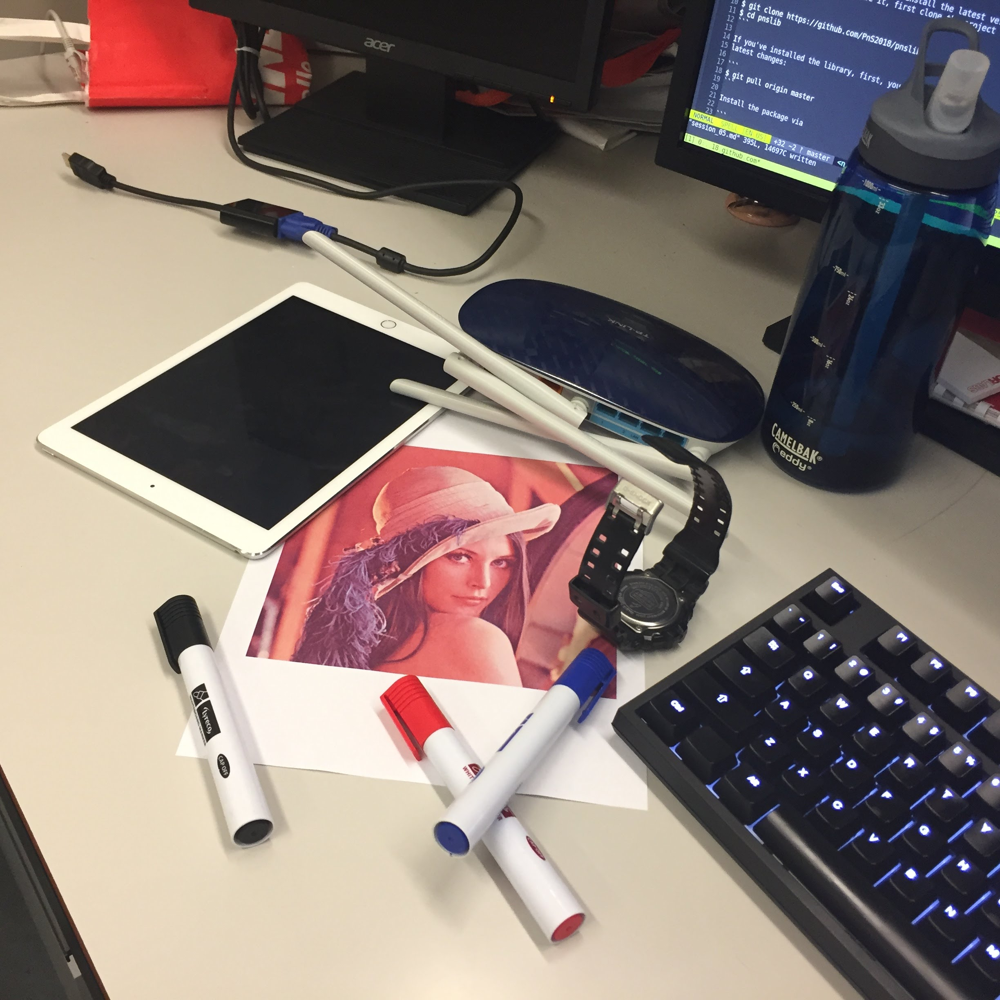

In this session, we are going to discuss some advanced topics in
Computer Vision without explaining too many mathematical details.
These are essential tools that you can use every day in your
projects.

We are also going to discuss some technical topics including how to
interact with the camera on Raspberry Pi, how to develop a proper
Python project and some additional tips and tricks for
solving Machine Learning problems in general.

## Work with Pi Camera

We have equipped the Raspberry Pi Camera on the Raspberry Pi
so that you can get the video feed from the device.

To stream the frames from the Pi Camera, we need to
use a new Python package called `picamera[array]`.
The reason why we do not use OpenCV here is that one needs to
solve tedious driver issues.

The following example demonstrates how you can get a stream of frames
from the Pi Camera ([Script citation](https://www.pyimagesearch.com/2015/03/30/accessing-the-raspberry-pi-camera-with-opencv-and-python/)):

```python
# import the necessary packages
from picamera.array import PiRGBArray
from picamera import PiCamera
import time
import cv2

# initialize the camera and grab a reference to the raw camera capture
camera = PiCamera()
camera.resolution = (640, 480)
camera.framerate = 32
rawCapture = PiRGBArray(camera, size=(640, 480))

# allow the camera to warmup
time.sleep(0.1)

# capture frames from the camera
for frame in camera.capture_continuous(rawCapture, format="bgr", use_video_port=True):
  # grab the raw NumPy array representing the image, then initialize the timestamp
  # and occupied/unoccupied text
  image = frame.array

  # Display the resulting frame
  cv2.imshow('frame', image)
  # the loop breaks at pressing `q`
  if cv2.waitKey(1) & 0xFF == ord('q'):
      break

  # clear the stream in preparation for the next frame
  rawCapture.truncate(0)
```

A lot more examples can be found at the [documentation](https://picamera.readthedocs.io/en/release-1.13/) of the library.

## Work with Webcam

OpenCV provides a good interface for streaming data from
a video or a camera. The `VideoCapture` API can accept
a string that indicates the path of the video or
an integer that indicates a camera. Commonly, we use
the integer 0 (corresponding to `CAP_ANY`) so that the OpenCV
auto-detects the camera devices available.

Note that we only discuss a single camera setup, for accessing
multiple cameras, you need special treatments such as
camera synchronization.

Here we demonstrate an example that shows the basic usage
of the `VideoCapture` API:

```python
import numpy as np
import cv2

# open the camera
cap = cv2.VideoCapture(0)

while(True):
    # Capture frame-by-frame
    ret, frame = cap.read()

    # Our operations on the frame come here
    gray = cv2.cvtColor(frame, cv2.COLOR_BGR2GRAY)

    # Display the resulting frame
    cv2.imshow('frame', gray)
    # the loop breaks at pressing `q`
    if cv2.waitKey(1) & 0xFF == ord('q'):
        break

# When everything done, release the capture
cap.release()
cv2.destroyAllWindows()
```

OpenCV's APIs on reading videos are perhaps the most easy-to-use
ones on the market. But of course, there are different solutions:

+ `scikit-video` supports ranges of video related functions from reading and writing video files to motion estimation functions.
+ `moviepy` is a Python package for video editing. This package works quite well on some basic editing functions (such as cuts, concatenations, title insertion) and writing video (such as in GIF) with intuitive APIs

We encourage you to explore these options, but so far the OpenCV is perhaps
the most widely adopted solution for processing videos.

__Remark__: In the domain of Deep Learning, we rarely use the image
that has the resolution higher than `250x250`. Usually, we will
rescale and subsample them so that we would not have to process
every detail of the picture. We also suggest that for your projects,
you can cut the unnecessary parts, rescale the image or select only
the regions of interest.

## Feature Engineering

In classic Computer Vision, __Feature Engineering__ is an important step
before further analysis such as detection and recognition.
Commonly, this process selects/extracts useful information from the raw
inputs and passes to the next stage so that the later processes can
both focus on relevant details and reduce the computing overhead.

For example, when we want to identify a person from a database,
we can simply compare every picture available in the database
with the photo at the raw pixel level. This process may be effective
if these pictures record the front face and are aligned perfectly
and the lighting conditions are roughly the same.
Besides the limitation on the input data, this algorithm
also generates a massive amount of computing overhead that it may not
be feasible for running on a reasonable computer. Instead,
we can first extract the relevant features that identify the
person of interest, and then search the corresponding one
in the database. This alternative solution would boost the performance
greatly since you could identify the person with these selected features,
and these features are designed to be robust in different environments.

Note that in recent years, conventional Feature Engineering has largely been replaced by Deep Learning systems where these systems
integrate the Feature Engineering step into the architecture itself.
Instead of relying on carefully designed features, the features learned
by these DL systems are proven to be more robust to
the changes in the dataset.

In the next sections, we introduce some common feature engineering
techniques and show how we can use them for solving
Computer Vision tasks.

## Corner Detection

[](https://colab.research.google.com/drive/1FGs27KCZbh4h2zB9LWMwRGvTrCgLn0mR)

Corner Detection is one of the classical procedures of Computer Vision
preprocessing due to the reason that corners represent
a large variation in intensity in many directions.
And this can be very attractive in our above photo matching example.
If we can find the near identical corner features from two
different photos, we can roughly say that they share similar content
in the pictures (of course, in reality, this is not enough).

We give an OpenCV example as follows.

```python
import cv2
import numpy as np

img = cv2.imread("Lenna.png")
gray = cv2.cvtColor(img, cv2.COLOR_BGR2GRAY)

gray = np.float32(gray)
dst = cv2.cornerHarris(gray, 2, 3, 0.04)

dst = cv2.dilate(dst, None)

img[dst > 0.01*dst.max()] = [0, 0, 255]

cv2.imshow('dst', img)
if cv2.waitKey(0) & 0xff == 27:
    cv2.destroyAllWindows()
```

The above code uses _Harris Corner Detector_. OpenCV implements this
method in `cornerHarris` API. This API receives
four arguments:

+ `img`: input image, it should be grayscale and `float32` type.
+ `blockSize`: it is the size of the neighbourhood considered for corner detection
+ `ksize`: Aperture parameter of Sobel (from last session) derivative used.
+ `k`: Harries detector free parameter in the equation.

You will need to tune this corner detector for different images so that
you can get optimal results.

## Keypoints Detection

[](https://colab.research.google.com/drive/1p7McfxQdXSD32KO3jPFigejiiTQjKivp)

Corner detection is easy to implement and useful if you have
a picture that has a static resolution. And it is obvious that
this process is _rotation invariant_. However, when you scale the
image via interpolation or simply by taking a picture at a closer distance,
the result may change dramatically because
the corner in the original image may become flat in the new image.

A solution to find _scale invariant_ features in an image is SIFT (scale-invariant
feature transform). This algorithm is proposed by D. Lowe in a seminal paper
_Distinctive Image Features from Scale-Invariant Keypoints_.
We encourage that everyone should read this paper so that you can
get a better understanding. We are not going to present the details of the algorithm here because the material is out of the scope of this module. 

SIFT is a strong method for extracting features because the keypoints
are generally robust against different rotations, scales and even
lighting conditions (within a reasonable range). We can then use
these keypoints as the landmarks so that we can easily do
feature matching, image stitching, gesture recognition and video tracking.

Once the keypoints are identified, we can then compute the _descriptor_ -
a vector that describes the surrounding region of the keypoint.
First, we take a `16x16` neighborhood around the keypoint. Second,
this `16x16` region is divided into 16 sub-blocks of `4x4` size. Third, For each
sub-block, an 8-bin orientation histogram is created. So a total of `16x8=128`
bin values are available. This 128-values vector is then the descriptor of
the keypoint.

An OpenCV example is as follows:

```python
import cv2

img = cv2.imread('Lenna.png')
gray = cv2.cvtColor(img, cv2.COLOR_BGR2GRAY)

# for opencv 3.x and above
# you will need to run the following code to install
# pip install opencv-contrib-python -U
sift = cv2.xfeatures2d.SIFT_create()

kp = sift.detect(gray, None)

# for opencv 3.x and above
cv2.drawKeypoints(gray, kp, img)

cv2.imshow('dst', img)
cv2.waitKey(0)
cv2.destroyAllWindows()
```

SURF (Speed-Up Robust Features) is a sped-up version of SIFT.
In OpenCV, you can use the similar API for SURF.
SURF is good at handling images with blurring and rotation,
but not good at handling viewpoint change and illumination change.

Both SIFT and SURF are __patented__ software. You can not use them
in commercial software without paying the fees.
If you are looking for a free alternative, OpenCV Labs created a
solution that is called ORB (Oriented FAST and Rotated BRIEF).

__Remark__: SIFT and SURF are very popular preprocessing steps
even today. They are perhaps the most widely adopted feature engineering
techniques in "classical" Computer Vision (before the DL era).

## Feature Matching

[](https://colab.research.google.com/drive/1FF1J9njP7-Xoj5DwhldHVfqj7hM8KZgx)

Let's now consider a concrete application of the keypoints - _Feature Matching_.
We want to calculate the correspondence between the descriptors
of two images.

<hr>
<div align="center">
    <p>
    </p>
    <p>How do you find the corresponding keypoints between the left image and the right image?</p>
    <p><b>Left:</b> Lenna. <b>Right:</b> Lenna and objects</p>
</div>
<hr>

For example, if we want to find the Lenna image (the query image) from
an image that has many objects (the source image), we would try to match
the descriptors from both images. The most straightforward algorithm is just to
loop over all the possibilities manually, and if the descriptors are close
enough, we say that we find a match. The distance between two descriptors
is defined by the Euclidean distance. The following example demonstrates
the Brute Force Matcher in OpenCV:

```python
import cv2
from matplotlib import pyplot as plt

# read images in gray scale
img1 = cv2.imread('Lenna.png', 0)
img2 = cv2.imread('Lenna_and_objects.jpg', 0)

# Initiate SIFT detector
sift = cv2.xfeatures2d.SIFT_create()

# find the keypoints and descriptors with SIFT
kp1, des1 = sift.detectAndCompute(img1, None)
kp2, des2 = sift.detectAndCompute(img2, None)

# initialize brute-force matcher
bf = cv2.BFMatcher_create()
# if on raspberry pi, use
bf = cv2.BFMatcher()

# matching with KNN matcher, find k=2 best matches for each descriptors.
matches = bf.knnMatch(des1, des2, k=2)

# store all the good matches as per Lowe's ratio test.
good = []
for m, n in matches:
    # only preserve the matches are close enough to each other
    if m.distance < 0.7*n.distance:
        good.append(m)

# draw matches on the image
img3 = cv2.drawMatches(img1, kp1, img2, kp2, good, None, flags=2)

# display the result
plt.imshow(img3, 'gray'), plt.show()
```

If you have completed the above example, you can then
download [this script](./res/code/opencv_feature_matching.py).
This script demonstrates how to localize the Lenna image in the above
example. The idea is that by using these keypoints, one can
calculate a perspective transformation by using `findHomography` API.
The script is adapted from the [OpenCV tutorial](https://docs.opencv.org/3.4.1/d1/de0/tutorial_py_feature_homography.html). Note that you might need to modify it
if you are running this on the Raspberry Pi.

## Face Detection

[](https://colab.research.google.com/drive/1CmZwkzrkap3nvPvUbuYy3NBZPe5jYZls)

In this section, we would like to show you how to detect a human
face with OpenCV. This is achieved by using _Haar Feature-based
cascade Classifiers_. The idea is straightforward: by giving many
positive and negative samples, we can use pre-selected filters
to build a classifier that only accepts the regions that contain
specific feature patterns. We will not further elaborate the algorithm;
interested readers can read the original paper _Rapid Object Detection
using a Boosted Cascade of Simple Features_ that was published in 2001.

To proceed, you will need to install the latest version of
the `pnslib`. If you don't have it, clone the project to any
directory:

```
$ git clone https://github.com/PnS2019/pnslib
$ cd pnslib
```

If you've installed the library, you need to pull the
latest changes:

```
$ git pull origin master
```

Install the package via

```
$ python setup.py develop
```

Run the following examples, you should be able to correctly detect
the face and eyes of Lenna.

```python
import cv2
from pnslib import utils

# read image
img = cv2.imread("Lenna.png")

# load face cascade and eye cascade
face_cascade = cv2.CascadeClassifier(
    utils.get_haarcascade_path('haarcascade_frontalface_default.xml'))
eye_cascade = cv2.CascadeClassifier(
    utils.get_haarcascade_path('haarcascade_eye.xml'))

# search face
gray = cv2.cvtColor(img, cv2.COLOR_BGR2GRAY)

faces = face_cascade.detectMultiScale(gray, 1.3, 5)

for (x, y, w, h) in faces:
    cv2.rectangle(img, (x, y), (x+w, y+h), (255, 0, 0), 2)
    roi_gray = gray[y:y+h, x:x+w]
    roi_color = img[y:y+h, x:x+w]
    eyes = eye_cascade.detectMultiScale(roi_gray)
    for (ex, ey, ew, eh) in eyes:
        cv2.rectangle(roi_color, (ex, ey), (ex+ew, ey+eh), (0, 255, 0), 2)

cv2.imshow('img', img)
cv2.waitKey(0)
cv2.destroyAllWindows()
```

OpenCV has many pre-trained Haar Cascades classifiers for body
parts. Turns out they are very efficient in detecting regions of interest.
Because this method only uses simple features, these classifiers
would fail if the training condition is not met. For example, if you
rotate your head and show only one side of the face, this classifier
will fail to detect the face.
Nevertheless, these pre-trained classifiers are still very useful if you
simply want to implement a decent human detection system.
Available Haar Cascades in OpenCV are as follows:

```
1. haarcascade_eye.xml
2. haarcascade_eye_tree_eyeglasses.xml
3. haarcascade_frontalcatface.xml
4. haarcascade_frontalcatface_extended.xml
5. haarcascade_frontalface_alt.xml
6. haarcascade_frontalface_alt2.xml
7. haarcascade_frontalface_alt_tree.xml
8. haarcascade_frontalface_default.xml
9. haarcascade_fullbody.xml
10. haarcascade_lefteye_2splits.xml
11. haarcascade_licence_plate_rus_16stages.xml
12. haarcascade_lowerbody.xml
13. haarcascade_profileface.xml
14. haarcascade_righteye_2splits.xml
15. haarcascade_russian_plate_number.xml
16. haarcascade_smile.xml
17. haarcascade_upperbody.xml
```

__Remark__: In recent years, DL systems have advanced
the face detection field by taking the rotation factor into account.


## How to Develop a Python Project

You will be working on your projects from the next session on. Working on a
deep learning project involves lots of data, experiments and analyzing the
results. So, it is imperative that you maintain a good structure in your project
folder so you can handle your work in a smooth fashion. Here are a few tips
that will help you in this regard. Note that the points mentioned below are
just helpful guidelines, and you free to use it, tweak it or follow a
completely different folder structure as per your convenience.

Before you start a project, there are a few things (not an exhaustive list by any means) that you have to do in general.

1. Implement a model architecture
2. Train the model
3. Test the model
4. Take care of the data
5. Take care of any hyper parameter tuning (optional)
6. Keep track of the results
7. Replicate any experiment

So your folder structure should take care of these requirements.

#### Folder structure
Initialize a github project on the PnS2019 github repository, and clone it to your working machine. The folder structure can be organized as follows.

1. __README__ file: A README file with some basic information about the project, like the required dependencies, setting up the project and replicating an experiment, links to the dataset. This is really useful both for you and anyone you are sharing your project with.
2. __data__ folder: A data folder to host the data is useful if it is kept separate. Given that some of your projects involve data collection, your data generation scripts can also be hosted in this directory.
3. __models__ folder: You can put your model implementations in this folder.
4. __main.py__ file: The main file is the main training script for the project. Ideally you would want to run this script with some parameters of choice to train a required model.
5. __tests__ folder: You can put your testing files in this folder.
6. __results__ folder: You can save all your results in your project in this folder, including saved models, graphs of your training progress, other results when testing your models that you want to pull out later.

You can modify this basic structure to suit the needs of your project, but make sure that you start with a plan rather than figuring out your project structure on the go.

An example project repository can be found [here](https://github.com/PnS2019/sample_project_repository).

## Tips and Tricks in Machine Learning

Some of you were interested in knowing some general tips and tricks that people
use in machine learning. The most important tip is that there are no general
tricks that would help you get the best model. Having said that, there are a
few things that you can keep in mind when you want to optimize a model. Most of
the points mentioned here are summarized from an [online post](https://machinelearningmastery.com/improve-deep-learning-performance/).

1. One of the most important trick to get a better model is to have __more
data__. Whether you gather more data, generate them artificially or augment the
original data is up to you.
2. __Optimizing your input features__. You can optimize the features that you feed
to the network through some preprocessing techniques. One of the most commonly
used preprocessing techniques are standardizing your data to a zero mean and one
variance distribution and using a dimensionality reduction to reduce your input
dimensionality.
3. __Optimizing your learning rule__. The
most popular learning rule used nowadays is the 'Adam' learning rule, but more
recent works suggest that the use of stochastic gradient descent with learning
rate schedulers is rising. But keep track of the recent literature for
experiments regarding optimal learning rules. Also keep in mind that there is no
single learning rule for every task.
4. __Avoid overfitting and underfitting__. Make sure your model is not overfitting and
underfitting. If your model is overfitting, either add more data or decrease the number of
parameters in your model or use regularizing techniques. If your model is underfitting,
increase the number of parameters in your model, and look for different architectures to improve
the performance.
5. __Weight initialization__. Weight initialization makes a huge difference to your model's
training performance and the final accuracy, especially for the deeper models. So keep that in mind
and look for experiments in the literature about optimal weight initializations.
6. __Batch size and epochs__. Ideally you would want to use the whole dataset as your batch size.
But computing and memory constraints usually limit you from doing so. Perform a hyper parameter
search for the optimal batch size. Another hyper parameter to optimize is the number of
epochs to train on. Training for more and more epochs usually leads to overfitting especially if
your model is over the required capacity. You can use a technique called early stopping where the
training is stopped when you observe that the validation performance is not getting better with
increasing number of epochs.
7. __Ensemble techniques__. Another commonly used technique to improve the performance on a
particular task is using multiple models each trained separately and then using the combined
prediction of these models to enhance the overall performance on your task. But keep in mind that
usually the marginal gain in performance is too low for the use of extra computation and memory.
But nevertheless, this is a technique that could prove useful in case you are looking to optimize
the performance.

There are many other techniques used to optimize the performance of deep learning models, but it
is usually suggested that you look for them depending on the task at hand. There's a wide amount
of open literature, and remember that search engines are your friends for most of the basic
questions.

## Closing Remarks

In the last five sessions, we learned how to use Keras for symbolic computation
and for solving Machine Learning problems. We also learned how to use
OpenCV, `numpy`, `scikit-image` to process image data.
You might be overwhelmed by how many softwares there are to solve
some particular problem. You probably wonder if this is enough for
dealing with practical issues in future projects.

The answer is a hard NO. Keras might be the best way of prototyping
new ideas. However, it is not the best software to scale,
it is not the fastest ML software on the market, and researchers from
different domains have different preferences in choosing and using a software.
In [this page](./dl-res.html), we listed some other influential
software that is currently being employed in academia and industry.

Arguably, the best way of learning a programming language/library is
to do a project. In the following weeks, you will need to
choose a project that uses the knowledge you learned in the past
five weeks. Furthermore, everything has to be working on a Raspberry Pi.
